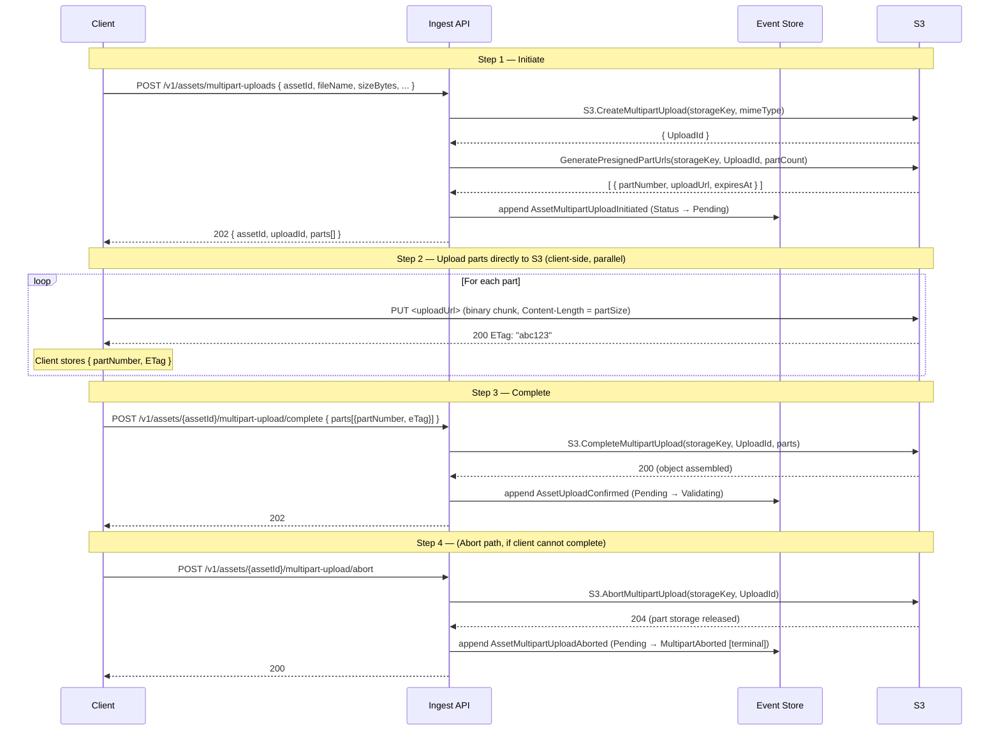

# Asset — API

_Context: `AssetManagement`_
_Aggregate: `Asset`_

---

## API Conventions

Cross-cutting concerns follow [`spec/shared/api-conventions.md`](../../../../shared/api-conventions.md).

- **Authentication:** `Authorization: Bearer <jwt>` required on all endpoints.
- **Idempotency:** All mutating endpoints (POST, PUT, PATCH, DELETE) accept `IdempotencyKey: <uuid>`. Replaying the same key within the TTL returns the cached response. See [§Idempotency](../../../../shared/api-conventions.md#idempotency).
- **Errors:** All error responses use `Content-Type: application/problem+json` (RFC 9457 `ProblemDetails`). See [§Error Contract](../../../../shared/api-conventions.md#error-contract--rfc-9457-problemdetails).

---

## Route Structure

```
POST   /v1/assets/uploads                        Initiate single-part upload
POST   /v1/assets/uploads/bulk                   Bulk initiate uploads (up to 50)
POST   /v1/assets/uploads/bulk-confirm           Bulk confirm uploads
POST   /v1/assets/{assetId}/uploads/confirm      Confirm single-part S3 upload
POST   /v1/assets/multipart-uploads              Initiate multipart upload
POST   /v1/assets/{assetId}/multipart-upload/complete  Complete multipart upload (with ETags)
POST   /v1/assets/{assetId}/multipart-upload/abort     Abort multipart upload
POST   /v1/assets/{assetId}/tags                 Replace the full tag set (full replace, not additive)
POST   /v1/assets/{assetId}/archive              Archive an asset (owner-initiated, soft-delete)
DELETE /v1/assets/{assetId}                      Hard-delete an archived asset (permanent)
GET    /v1/assets/{assetId}                      Get asset detail
GET    /v1/assets?itemId=&status=                List assets for a MediaItem
GET    /v1/assets/{assetId}/download             Get presigned download URL (original binary)
GET    /v1/assets/{assetId}/renditions/{renditionType}/download  Get presigned download URL (rendition)
```

---

## Authorization Requirements

All endpoints require a valid JWT with `actor_type = "User"` (or `"System"` for internal commands).

| Endpoint | Requirement |
|---|---|
| `POST /v1/assets/uploads` | `caller.owner_id` = asset owner |
| `POST /v1/assets/{assetId}/uploads/confirm` | Called by Ingest API internally (S3 event) |
| `POST /v1/assets/multipart-uploads` | `caller.owner_id` = asset owner |
| `POST /v1/assets/{assetId}/multipart-upload/complete` | `caller.owner_id == asset.OwnerId` |
| `POST /v1/assets/{assetId}/multipart-upload/abort` | `caller.owner_id == asset.OwnerId` |
| `POST /v1/assets/{assetId}/archive` | `caller.owner_id == asset.OwnerId` |
| `DELETE /v1/assets/{assetId}` | `caller.owner_id == asset.OwnerId` |
| `GET /v1/assets/{assetId}` | `caller.owner_id == asset.OwnerId` |
| `GET /v1/assets?itemId=` | `caller.owner_id == mediaItem.OwnerId` |
| `GET /v1/assets/{assetId}/download` | `caller.owner_id == asset.OwnerId` · asset must be `Active` or `Archived` |
| `GET /v1/assets/{assetId}/renditions/{renditionType}/download` | `caller.owner_id == asset.OwnerId` · asset must be `Active` or `Archived` |

---

## Write Endpoints (Ingest API)

### `POST /v1/assets/uploads`

Initiates an Asset upload. Issues a pre-signed S3 PUT URL. Dispatches `InitiateAssetUploadCommand`.

**Request:**
```json
{
  "assetId": "018e4c7a-3f10-7b2a-8c4d-1a2b3c4d5e6f",
  "fileName": "photo.jpg",
  "contentType": "image/jpeg",
  "sizeBytes": 1048576,
  "mediaItemId": "018e4c7b-1a20-7c3d-9e4f-2b3c4d5e6f70"
}
```

`mediaItemId` is optional — omit for standalone (drag-and-drop) uploads.
`assetId` is caller-generated (UUID v7) for idempotent upload initiation.

**Response `202 Accepted`:**
```json
{
  "id": "018e4c7a-3f10-7b2a-8c4d-1a2b3c4d5e6f",
  "uploadUrl": "https://media-source.s3.amazonaws.com/...",
  "expiresAt": "2026-03-26T12:15:00Z"
}
```

**Error responses:**
- `400` — validation failure (invalid fileName, unsupported contentType, size exceeds media-profile max)
- `401` — unauthenticated
- `404` — `mediaItemId` does not exist
- `409` — `mediaItemId` is archived
- `413` — storage quota exceeded
- `429` — rate limit

**Upload guards (run in `UploadAssetHandler` before URL issuance):**
1. If `mediaItemId` is present: resolve existence + lifecycle + capabilities via `IMediaItemCapabilityReadModel` (backed by the `media-item-capability-refs` reference model).
2. `sizeBytes` must not exceed the media-profile's `MaxFileSizeBytes` (or the platform default for standalone uploads). The pre-signed URL carries a matching `content-length-range` condition.
3. Quota is evaluated via `IBillingAcl.CheckQuotaAsync(OwnerId, sizeBytes)` unless the media-item's media-profile lacks the `Processing` capability (documents are quota-exempt).

_Accepts `IdempotencyKey` header._

**Error response example (`413 Content Too Large`):**
```json
{
  "type": "https://errors.magiqmedia.com/domain/storage-quota-exceeded",
  "title": "Storage quota exceeded",
  "status": 413,
  "detail": "Owner owner_018e4c7c-... has insufficient storage quota for a 1048576-byte upload.",
  "extensions": { "errorCode": "StorageQuotaExceeded", "requestedBytes": 1048576 }
}
```

---

### `POST /v1/assets/{assetId}/uploads/confirm`

Confirms that the S3 upload completed. Triggered by Ingest API on receipt of S3 `ObjectCreated` SQS notification. Dispatches `ConfirmAssetUploadCommand`.

**Response `202 Accepted`** — no body.

**Error responses:**
- `404` — asset not found
- `409` — asset not in `Pending` status

_Accepts `IdempotencyKey` header._

**Error response example (`409 Conflict`):**
```json
{
  "type": "https://errors.magiqmedia.com/domain/asset-not-pending",
  "title": "Asset is not in Pending status",
  "status": 409,
  "detail": "Asset 018e4c7a-... is in status Active. Upload confirmation is only valid for Pending assets.",
  "extensions": { "errorCode": "AssetNotPending", "currentStatus": "Active" }
}
```

---

## Multipart Upload Endpoints (Ingest API)

### S3 Multipart Upload — Integration Sequence

The multipart flow spans three API calls and direct client-to-S3 part uploads. Use multipart for files ≥ 100 MB; the platform default part size is 50 MB (configurable per deployment).



**Presigned part URL constraints:**
- Each URL is signed for `PUT` on a single part number.
- Part URLs expire in 15 minutes (same TTL as single-part PUT URLs). If upload takes longer, abort and re-initiate.
- S3 rejects parts smaller than 5 MB except for the final part.
- The assembled object must match `sizeBytes` declared at initiation; `ConfirmAssetUpload` is **not** called for multipart — `CompleteMultipartUpload` transitions directly to `Validating`.

---

### `POST /v1/assets/multipart-uploads`

Initiates an S3 multipart upload for a large asset. Runs identical guards to `POST /v1/assets/uploads` (existence, archive state, max file size, quota). Dispatches `InitiateMultipartUploadCommand`.

**Request:**
```json
{
  "assetId": "018e4c7a-3f10-7b2a-8c4d-1a2b3c4d5e6f",
  "fileName": "4k-master.mp4",
  "contentType": "video/mp4",
  "sizeBytes": 2684354560,
  "mediaItemId": "018e4c7b-1a20-7c3d-9e4f-2b3c4d5e6f70"
}
```

`mediaItemId` is optional. `assetId` is caller-generated (UUID v7).

**Response `202 Accepted`:**
```json
{
  "id": "018e4c7a-3f10-7b2a-8c4d-1a2b3c4d5e6f",
  "uploadId": "VXBsb2FkIElEIGZvciA2aWWpbmcncyBteS1tb3ZpZS5t",
  "parts": [
    { "partNumber": 1, "uploadUrl": "https://media-source.s3.amazonaws.com/...&partNumber=1&uploadId=...", "expiresAt": "2026-04-26T12:15:00Z" },
    { "partNumber": 2, "uploadUrl": "https://media-source.s3.amazonaws.com/...&partNumber=2&uploadId=...", "expiresAt": "2026-04-26T12:15:00Z" }
  ]
}
```

Part count is server-computed: `ceil(sizeBytes / partSizeBytes)` using deployment config (default 50 MB parts).

**Error responses:**
- `400` — validation failure (invalid fileName, unsupported contentType, size exceeds media-profile max)
- `401` — unauthenticated
- `404` — `mediaItemId` does not exist
- `409` — `mediaItemId` is archived
- `413` — storage quota exceeded
- `429` — rate limit

_Accepts `IdempotencyKey` header._

**Error response example (`409 Conflict` — archived MediaItem):**
```json
{
  "type": "https://errors.magiqmedia.com/domain/media-item-archived",
  "title": "Media item is archived",
  "status": 409,
  "detail": "MediaItem 018e4c7b-... is archived. Assets cannot be uploaded to archived media-items.",
  "extensions": { "errorCode": "MediaItemArchived" }
}
```

---

### `POST /v1/assets/{assetId}/multipart-upload/complete`

Signals that all S3 parts have been uploaded. The client provides the ETags returned by S3 for each part. Handler calls `S3.CompleteMultipartUpload` then transitions `Pending → Validating`. Dispatches `CompleteMultipartUploadCommand`.

**Request:**
```json
{
  "parts": [
    { "partNumber": 1, "eTag": "\"d8c2eafd90c266e19ab9dcacc479f8af\"" },
    { "partNumber": 2, "eTag": "\"d8c2eafd90c266e19ab9dcacc479f8ae\"" }
  ]
}
```

**Response `202 Accepted`** — no body.

**Error responses:**
- `400` — missing or malformed parts list
- `404` — asset not found
- `409` — asset not in `Pending` state, or `UploadMode` is not `Multipart`
- `422` — S3 `CompleteMultipartUpload` rejected (ETag mismatch, missing parts, etc.)

_Accepts `IdempotencyKey` header._

**Error response example (`422 Unprocessable Entity` — ETag mismatch):**
```json
{
  "type": "https://errors.magiqmedia.com/validation/multipart-complete-rejected",
  "title": "S3 multipart complete rejected",
  "status": 422,
  "detail": "S3 rejected CompleteMultipartUpload for asset 018e4c7a-...: ETag mismatch on part 2.",
  "extensions": { "errorCode": "MultipartCompleteRejected" }
}
```

---

### `POST /v1/assets/{assetId}/multipart-upload/abort`

Aborts the multipart upload. Calls `S3.AbortMultipartUpload` to release part storage, then transitions the asset to `MultipartAborted` (terminal). Dispatches `AbortMultipartUploadCommand`.

**Response `202 Accepted`** — no body.

**Error responses:**
- `404` — asset not found
- `409` — asset not in `Pending` state, or `UploadMode` is not `Multipart`

_Accepts `IdempotencyKey` header._

**Error response example (`409 Conflict`):**
```json
{
  "type": "https://errors.magiqmedia.com/domain/asset-not-pending-multipart",
  "title": "Asset is not a pending multipart upload",
  "status": 409,
  "detail": "Asset 018e4c7a-... is not in Pending status with UploadMode = Multipart.",
  "extensions": { "errorCode": "AssetNotPendingMultipart", "currentStatus": "Active" }
}
```

---

## Asset Lifecycle Endpoints

### `POST /v1/assets/{assetId}/tags`

Replaces the full tag set on an asset. This is a **full replace** — any tags omitted from the request are removed. Callers must include existing tags they wish to retain. Submit an empty array to clear all tags. Duplicates are deduplicated server-side.

**Pre-condition:** `asset.Status == Active`. Returns `409` for any other status.

**Tag validation:** Each tag must be 2–50 characters, alphanumeric with spaces, underscores, and hyphens allowed. Must start and end with an alphanumeric character (`^[a-zA-Z0-9][a-zA-Z0-9 _-]{0,48}[a-zA-Z0-9]$`).

**Request:**
```json
{
  "tags": ["approved", "final", "hero-image"]
}
```

**Response `200 OK`:**
```json
{
  "id": "018e4c7a-...",
  "tags": ["approved", "final", "hero-image"],
  "timestamp": "2026-05-13T10:00:00Z"
}
```

**Errors:** `400` — tag value fails validation · `401` · `403` — caller does not own this asset · `404` — asset not found · `409` — asset is not `Active`

**Error response example (`409 Conflict`):**
```json
{
  "type": "https://errors.magiqmedia.com/domain/asset-not-active",
  "title": "Asset is not active",
  "status": 409,
  "detail": "Asset 018e4c7a-... is in status Validating. Tags can only be set on Active assets.",
  "extensions": { "errorCode": "AssetNotActive", "currentStatus": "Validating" }
}
```

---

### Cascade Behaviour

> **Design decision (confirmed):** Archiving an asset does **not** automatically unassign it from any MediaItem role. The MediaItem retains the `assetId` reference and role name after archive. The archived asset becomes inaccessible for delivery, but no domain event is raised on the MediaItem side. Owners who want a clean removal must explicitly unassign the role (via the MediaItem role-assignment endpoint) before or after archiving. The same applies to hard delete — MediaItem role slots are orphaned after `AssetDeleted`. This is intentional: the MediaItem lifecycle and the Asset lifecycle are independently managed. Unassigning is a deliberate, separate owner action.

---

### `POST /v1/assets/{assetId}/archive`

> 🔧 **Requires implementation (R-29 · Phase 5):** This endpoint must be implemented. The command handler, domain event (`AssetArchived`), and integration event fan-out to Billing/Notifications subscribers are all required.

Archives an asset (soft-delete). S3 objects are retained. Dispatches `ArchiveAssetCommand`.

**Archiveable statuses:** `Active`, `ProcessingFailed`. All other statuses return `409`.

**Response `202 Accepted`** — no body.

**Error responses:**
- `401` — unauthenticated
- `403` — caller does not own this asset
- `404` — asset not found
- `409` — asset is not in an archiveable status

_Accepts `IdempotencyKey` header._

**Error response example (`409 Conflict`):**
```json
{
  "type": "https://errors.magiqmedia.com/domain/asset-not-archivable",
  "title": "Asset cannot be archived",
  "status": 409,
  "detail": "Asset 018e4c7a-... is in status Validating. Only Active or ProcessingFailed assets can be archived.",
  "extensions": { "errorCode": "AssetNotArchivable", "currentStatus": "Validating" }
}
```

---

### `DELETE /v1/assets/{assetId}`

> 🔧 **Requires implementation (R-29 · Phase 5):** This endpoint must be implemented. S3 `DeleteObjectsAsync` must be called synchronously before the `AssetDeleted` domain event is emitted. Integration events to Billing and Notifications subscribers are required. The pre-condition check (`asset.Status == Archived`) must be enforced as a DynamoDB conditional expression.

Hard-deletes an asset permanently. Deletes all S3 objects (original + all renditions) inline before emitting `AssetDeleted`. Dispatches `DeleteAssetCommand`.

**Pre-conditions:**
1. `asset.Status ∈ {Active, Archived, ValidationFailed, ProcessingFailed}` — all other statuses return `409`.
2. `asset.IsAssigned() == false` unless status is `ValidationFailed` or `ProcessingFailed` — assigned assets are locked to the MediaItem lifecycle. Unassign from the role before deleting, or manage deletion through the MediaItem. Returns `409`.

`VersionArtifact` assets are domain-blocked regardless of the above — use `PurgeVersion` on the owning MediaItem.

**S3 deletion is synchronous.** If `S3.DeleteObjectsAsync` fails, the command returns `500` and the asset remains unchanged. No partial deletion — all S3 objects are deleted atomically in a single `DeleteObjects` call.

**Response `204 No Content`** — no body. S3 deletion completes inline before the response is sent; `202` would incorrectly imply async work in flight.

**Error responses:**
- `401` — unauthenticated
- `403` — caller does not own this asset
- `404` — asset not found
- `409` — asset is not in a deletable status, is a version artifact, or is assigned to a MediaItem role

_Accepts `IdempotencyKey` header._

**Error response example (`409 Conflict` — assigned asset):**
```json
{
  "type": "https://errors.magiqmedia.com/domain/asset-not-deletable",
  "title": "Asset cannot be deleted",
  "status": 409,
  "detail": "Asset 018e4c7a-... is assigned to a media item role and cannot be deleted directly. Unassign the asset from the role before deleting.",
  "extensions": { "errorCode": "AssetNotDeletable", "currentStatus": "Active" }
}
```

**Error response example (`409 Conflict` — wrong status):**
```json
{
  "type": "https://errors.magiqmedia.com/domain/asset-not-deletable",
  "title": "Asset cannot be deleted",
  "status": 409,
  "detail": "Asset 018e4c7a-... is in status Validating. Only Active, Archived, ValidationFailed, or ProcessingFailed assets may be deleted.",
  "extensions": { "errorCode": "AssetNotDeletable", "currentStatus": "Validating" }
}
```

---

## Read Endpoints (Query API)

### `GET /v1/assets/{assetId}`

Returns full asset detail.

**Response `200 OK`:**
```json
{
  "id": "018e4c7a-3f10-7b2a-8c4d-1a2b3c4d5e6f",
  "mediaItemId": "018e4c7b-1a20-7c3d-9e4f-2b3c4d5e6f70",
  "ownerId": "owner_018e4c7c-...",
  "status": "Active",
  "contentType": "Image",
  "originalFileName": "photo.jpg",
  "roleName": "hero-image",
  "isPrimary": true,
  "tags": ["approved", "final"],
  "renditions": [
    {
      "renditionType": "thumbnail",
      "storageKey": "...",
      "contentType": "image/webp",
      "width": 256,
      "height": 256,
      "sizeBytes": 12400
    }
  ],
  "metadata": {
    "format": "JPEG",
    "width": 3840,
    "height": 2160,
    "dpiX": 72,
    "dpiY": 72,
    "colorSpace": "sRGB",
    "bitDepth": 8,
    "exifData": {
      "camera_make": "Canon",
      "gps_latitude": "51.5074"
    }
  },
  "createdAt": "2026-03-26T10:00:00Z"
}
```

**Error responses:**
- `401` — unauthenticated
- `403` — caller does not own this asset
- `404` — not found

---

### `GET /v1/assets?itemId={id}&status={status}`

Lists media-assets for a MediaItem, optionally filtered by status.

**Query parameters:**

| Param | Type | Notes |
|---|---|---|
| `itemId` | `string` | Required |
| `status` | `string?` | Optional — filters by `AssetStatus` |
| `pageToken` | `string?` | Pagination cursor |
| `pageSize` | `int?` | Default 20, max 100 |

**Response `200 OK`:**
```json
{
  "assets": [
    {
      "id": "...",
      "mediaItemId": "...",
      "status": "Active",
      "contentType": "Image",
      "originalFileName": "photo.jpg",
      "roleName": "hero-image",
      "createdAt": "2026-03-26T10:00:00Z"
    }
  ],
  "nextPageToken": null
}
```

---

### `GET /v1/assets/{assetId}/download`

Returns a short-lived presigned S3 GET URL for the original asset binary. The client uses this URL to download the file directly from S3 — no Lambda proxy involved.

**Status guard:** Asset must be `Active` or `Archived`. All other statuses return `409`.

**URL TTL:** 15 minutes (matches upload URL TTL per ADR-004).

**Response `200 OK`:**
```json
{
  "downloadUrl": "https://media-source.s3.amazonaws.com/tenantId/.../original.jpg?X-Amz-...",
  "expiresAt": "2026-05-29T12:15:00Z",
  "fileName": "photo.jpg",
  "contentType": "image/jpeg",
  "sizeBytes": 1048576
}
```

`ResponseContentDisposition: attachment; filename="photo.jpg"` is signed into the URL so browsers trigger a save dialog.

**Error responses:**
- `401` — unauthenticated
- `403` — caller does not own this asset
- `404` — asset not found
- `409` — asset is not `Active` or `Archived`

**Error response example (`409 Conflict`):**
```json
{
  "type": "https://errors.magiqmedia.com/domain/asset-not-downloadable",
  "title": "Asset is not downloadable",
  "status": 409,
  "detail": "Asset 018e4c7a-... is in status Processing. Only Active or Archived assets can be downloaded.",
  "extensions": { "errorCode": "AssetNotDownloadable", "currentStatus": "Processing" }
}
```

---

### `GET /v1/assets/{assetId}/renditions/{renditionType}/download`

Returns a short-lived presigned S3 GET URL for a specific rendition of the asset. Renditions are served from the `media-renditions` bucket.

**Status guard:** Asset must be `Active` or `Archived`. Returns `409` for any other status.

**`renditionType`:** Case-insensitive. Valid values are the rendition types present on the asset (e.g. `thumbnail`, `preview`, `web`). Returns `404` if the requested type does not exist on this asset.

**URL TTL:** 15 minutes. No `ResponseContentDisposition` is set — renditions are display assets, not forced downloads.

**Response `200 OK`:**
```json
{
  "downloadUrl": "https://media-renditions.s3.amazonaws.com/tenantId/.../thumbnail.webp?X-Amz-...",
  "expiresAt": "2026-05-29T12:15:00Z",
  "renditionType": "thumbnail",
  "contentType": "image/webp",
  "fileSizeBytes": 12400,
  "width": 256,
  "height": 256
}
```

**Error responses:**
- `401` — unauthenticated
- `403` — caller does not own this asset
- `404` — asset not found, or rendition type does not exist on this asset
- `409` — asset is not `Active` or `Archived`

---

## Command → Event → Projection Traceability

| API Call | Command | Domain Event | Projection |
|---|---|---|---|
| `POST /v1/assets/uploads` | `InitiateAssetUploadCommand` | `AssetUploadInitiated` | `AssetSummaryProjector` + `AssetDetailProjector` → INSERT (status: `Pending`, `UploadMode: SinglePart`) |
| `POST /v1/assets/{id}/uploads/confirm` | `ConfirmAssetUploadCommand` | `AssetUploadConfirmed` | `AssetSummaryProjector` + `AssetDetailProjector` → status UPDATE (`Pending → Validating`) |
| `POST /v1/assets/multipart-uploads` | `InitiateMultipartUploadCommand` | `AssetMultipartUploadInitiated` | `AssetSummaryProjector` + `AssetDetailProjector` → INSERT (status: `Pending`, `UploadMode: Multipart`) |
| `POST /v1/assets/{id}/multipart-upload/complete` | `CompleteMultipartUploadCommand` | `AssetUploadConfirmed` | `AssetSummaryProjector` + `AssetDetailProjector` → status UPDATE (`Pending → Validating`) |
| `POST /v1/assets/{id}/multipart-upload/abort` | `AbortMultipartUploadCommand` | `AssetMultipartUploadAborted` | `AssetSummaryProjector` + `AssetDetailProjector` → status UPDATE (`Pending → MultipartAborted`) |
| (Processing integration event — `ProcessingJobScanResultEventHandler`) | `RecordValidationResultCommand` (pass) | `AssetValidationPassed` | `AssetSummaryProjector` + `AssetDetailProjector` → no status change; `AssetValidationPassedIntegrationEvent` published (carries `HasProcessingCapability`); saga created |
| (Processing integration event — `ProcessingJobScanResultEventHandler`) | `RecordValidationResultCommand` (fail/virus) | `AssetInfectionDetected` / `AssetValidationFailed` | `AssetSummaryProjector` + `AssetDetailProjector` → status UPDATE (`Validating → ContainsVirus` / `ValidationFailed`) |
| (Processing integration event — `ProcessingJobStartedEventHandler`) | `StartAssetProcessingCommand` | `AssetProcessingStarted` | `AssetSummaryProjector` + `AssetDetailProjector` → status UPDATE (`Validating → Processing`) |
| (Processing integration event — `ProcessingJobCompletedEventHandler`) | `CompleteAssetProcessingCommand` | `AssetProcessingCompleted` | `AssetSummaryProjector` + `AssetDetailProjector` → status UPDATE (`Processing → Active`); renditions + metadata stamped |
| (Processing integration event — `ProcessingJobFailedEventHandler`) | `FailAssetProcessingCommand` | `AssetProcessingFailed` | `AssetSummaryProjector` + `AssetDetailProjector` → status UPDATE (`Processing → ProcessingFailed`) |
| `POST /v1/assets/{id}/tags` | `TagAssetCommand` | `AssetTagged` | `AssetSummaryProjector` + `AssetDetailProjector` → UPDATE `Tags` |
| `POST /v1/assets/{id}/archive` | `ArchiveAssetCommand` | `AssetArchived` | `AssetSummaryProjector` + `AssetDetailProjector` → status UPDATE (`Active\|ProcessingFailed → Archived`) |
| `DELETE /v1/assets/{id}` | `DeleteAssetCommand` | `AssetDeleted` | `AssetSummaryProjector` + `AssetDetailProjector` → UPDATE status → `Deleted` |
| `GET /v1/assets/{id}` | `GetAssetByIdQuery` | — | reads `media-asset-detail` |
| `GET /v1/assets?itemId=` | `ListAssetsByMediaItemQuery` | — | reads `media-assets` |
| `GET /v1/assets/{id}/download` | `GetAssetDownloadUrlQuery` | — | reads `media-asset-detail`; calls S3 `GetPreSignedURL` (GET) |
| `GET /v1/assets/{id}/renditions/{type}/download` | `GetRenditionDownloadUrlQuery` | — | reads `media-asset-detail`; calls S3 `GetPreSignedURL` (GET) on rendition key |

---

## Related

- [Asset Write Model](./asset.write-model.md)
- [Asset Read Model](./asset.read-model.md)
- [AssetManagement Business Scenarios](../.
---

## Bulk Upload Endpoints

> Bulk operations follow the shared partial-success envelope. See [`spec/shared/bulk-operations.md`](../../../../shared/bulk-operations.md) for full conventions.

### `POST /v1/assets/uploads/bulk`

Initiates up to 50 asset uploads in a single request. Returns a pre-signed S3 PUT URL per successfully initiated asset. The client uploads each file directly to S3 in parallel (no Lambda proxy), then calls `POST /v1/assets/uploads/bulk-confirm` to complete the cycle.

**Quota:** A single aggregate `IBillingAcl.CheckQuotaAsync` call covers the total non-exempt bytes across all media-items. If the total exceeds quota, the entire request returns `400 QuotaExceeded` — no per-item partial quota handling.

**Pre-flight per media-item:**
1. If `mediaItemId` is set: resolve existence and archive status via `MediaItemCapabilityService`. Archived or missing → `Failed`.
2. `sizeBytes` must not exceed the media-profile's `MaxFileSizeBytes` → `Failed` with `errorCode = "FileSizeExceeded"`.
3. Items whose media-profile lacks the `Processing` capability are quota-exempt and excluded from the aggregate quota total.

**Request:**
```json
{
  "items": [
    {
      "assetId": "018f...",
      "mediaItemId": "018e...",
      "originalFileName": "hero.jpg",
      "contentType": "Image",
      "sizeBytes": 2048000
    },
    {
      "assetId": "018g...",
      "originalFileName": "trailer.mp4",
      "contentType": "Video",
      "sizeBytes": 524288000
    }
  ],
  "onError": "ContinueOnError"
}
```

`assetId` is caller-generated (UUID v7). If omitted, the server generates one.  
`mediaItemId` is optional — omit for standalone uploads.

**Response `201 Created`** — all media-items succeeded:
```json
{
  "succeeded": [
    {
      "index": 0,
      "id": "018f...",
      "uploadUrl": "https://media-source.s3.amazonaws.com/...",
      "expiresAt": "2026-05-11T12:15:00Z"
    },
    {
      "index": 1,
      "id": "018g...",
      "uploadUrl": "https://media-source.s3.amazonaws.com/...",
      "expiresAt": "2026-05-11T12:15:00Z"
    }
  ],
  "failed": [],
  "skipped": []
}
```

**Response `202 Accepted`** — partial results:
```json
{
  "succeeded": [
    { "index": 0, "id": "018f...", "uploadUrl": "...", "expiresAt": "2026-05-11T12:15:00Z" }
  ],
  "failed": [
    {
      "index": 1,
      "name": "trailer.mp4",
      "errorCode": "MediaItemArchived",
      "message": "Media item '018e...' is archived."
    }
  ],
  "skipped": []
}
```

**Errors (request-level):**
- `400` — batch exceeds 50 media-items, `QuotaExceeded` (total bytes over quota), or required fields missing
- `401` — unauthenticated
- `403` — permission denied

**Per-item error codes:**

| `errorCode` | Cause | Caller action |
|---|---|---|
| `ResourceNotFound` | `mediaItemId` does not exist | Verify the ID |
| `MediaItemArchived` | Target `mediaItemId` is archived | Un-archive first, or choose a different target |
| `FileSizeExceeded` | `sizeBytes` exceeds media-profile's `MaxFileSizeBytes` | Use a smaller file or a media-profile with a higher limit |

_Accepts `IdempotencyKey` header._

---

### `POST /v1/assets/uploads/bulk-confirm`

Confirms that up to 50 assets have been uploaded to S3. For each asset, the handler performs the same three-guard sequence as `POST /v1/assets/{assetId}/uploads/confirm` (S3 HEAD + content-type + declared-size + profile-limit checks) in parallel.

Assets already in `Validating` or `Active` state are treated as idempotent successes — no re-processing.

**Typical client workflow:**

```
1. POST /v1/assets/uploads/bulk         → receive { assetId, uploadUrl } per media-item
2. PUT  {uploadUrl}                 → client uploads each file directly to S3 (parallel)
3. POST /v1/assets/uploads/bulk-confirm        → confirm all uploads in one call
4. (async) pipeline: Validating → Active
```

**Request:**
```json
{
  "assetIds": [
    "018f...",
    "018g...",
    "018h..."
  ],
  "onError": "ContinueOnError"
}
```

**Response `201 Created`** — all media-items confirmed:
```json
{
  "succeeded": [
    { "index": 0, "id": "018f..." },
    { "index": 1, "id": "018g..." },
    { "index": 2, "id": "018h..." }
  ],
  "failed": [],
  "skipped": []
}
```

**Response `202 Accepted`** — partial results:
```json
{
  "succeeded": [
    { "index": 0, "id": "018f..." },
    { "index": 1, "id": "018g..." }
  ],
  "failed": [
    {
      "index": 2,
      "name": "018h...",
      "errorCode": "S3ObjectNotFound",
      "message": "S3 object not found for asset 018h.... The pre-signed URL may have expired before the upload completed."
    }
  ],
  "skipped": []
}
```

**Errors (request-level):**
- `400` — batch exceeds 50 media-items
- `401` — unauthenticated
- `403` — permission denied

**Per-item error codes:**

| `errorCode` | Cause | Caller action |
|---|---|---|
| `S3ObjectNotFound` | Client never PUT the file, or URL expired (15-min TTL) | Re-initiate via `POST /v1/assets/uploads/bulk` for this `assetId`, then re-confirm |
| `ContentTypeMismatch` | Actual S3 MIME type doesn't match declared `contentType` | Re-initiate with correct `contentType` |
| `DeclaredSizeExceeded` | Actual file is larger than `sizeBytes` declared at upload time | Re-initiate with correct `sizeBytes`; investigate client for quota abuse |
| `ProfileLimitExceeded` | Actual size exceeds the media-profile's `MaxFileSizeBytes` (media-profile tightened between upload and confirm) | Re-initiate with a smaller file or a higher-limit media-profile |
| `AssetNotConfirmable` | Asset is in a terminal state (e.g. `ValidationFailed`) | Cannot be confirmed; inspect current status |
| `ResourceNotFound` | Asset ID does not exist for this tenant | Verify the ID |

_Accepts `IdempotencyKey` header._

---

## Updated Command → Event → Projection Traceability

_(Existing table entries unchanged — appended below)_

| API Call | Command | Domain Event | Projection |
|---|---|---|---|
| `POST /v1/assets/uploads/bulk` | `BulkInitiateAssetUploadCommand` | `AssetUploadInitiated` (×N) | `AssetSummaryProjector` + `AssetDetailProjector` → INSERT (×N, status: `Pending`) |
| `POST /v1/assets/uploads/bulk-confirm` | `BulkConfirmAssetUploa