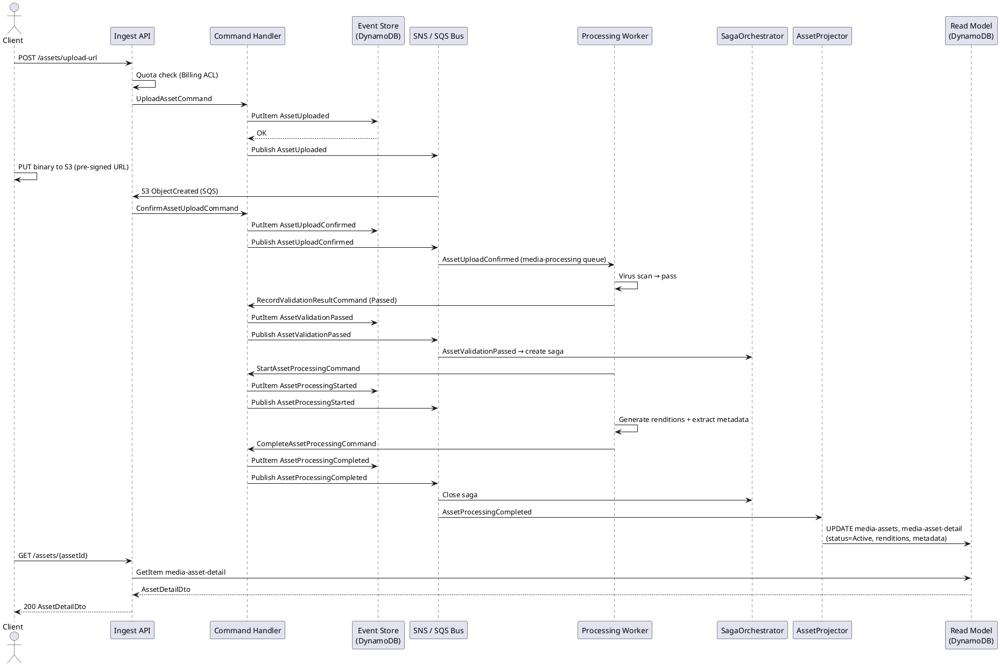
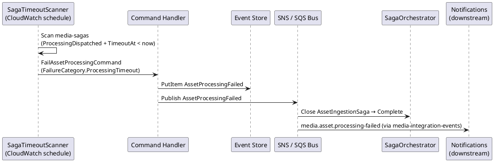
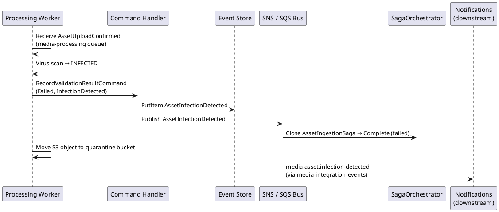

# Asset — Business Scenarios

_Context: `AssetManagement` · Aggregate: `Asset`_

---

## Index

| # | Scenario | Key Aggregates |
|---|---|---|
| A-1 | Upload and Process a Media Asset | Asset |
| A-2 | Drag-and-Drop Upload (Standalone Asset Before MediaItem) | Asset |
| A-3 | Processing Pipeline Failure Recovery | Asset, AssetIngestionSaga |
| AM-4 | Large File Upload (Multipart) | Asset, AssetIngestionSaga |
| AM-5 | Virus Scan Failure (Asset Infection Detected) | Asset, AssetIngestionSaga |
| AM-6 | User-Initiated Asset Archive | Asset |
| AM-7 | Asset Hard Delete | Asset |
| DL-1 | Download Original Asset (Presigned URL) | Asset |
| DL-2 | Download Asset Rendition (Presigned URL) | Asset |
| DL-3 | Expired Download URL — Access Denied by S3 | Asset |

---

## A-1: Upload and Process a Media Asset

### Scenario Overview

**Actors:** User (owner), Ingest API, Processing Worker, SagaOrchestrator
**Preconditions:** MediaItem exists in `Draft` status; MediaProfile has `Processing` capability
**Trigger:** `POST /assets/upload-url` with `mediaItemId` set

### API Call Flow

**Step 1: Initiate upload**
```
POST /assets/upload-url
Authorization: Bearer <jwt>

{
  "assetId": "018e4c7a-3f10-7b2a-8c4d-1a2b3c4d5e6f",
  "fileName": "hero.jpg",
  "contentType": "image/jpeg",
  "sizeBytes": 2097152,
  "mediaItemId": "018e4c7b-1a20-7c3d-9e4f-2b3c4d5e6f70"
}

→ 202 Accepted
{
  "assetId": "018e4c7a-...",
  "uploadUrl": "https://media-source.s3.amazonaws.com/...",
  "expiresAt": "2026-03-26T12:15:00Z"
}
```

**Step 2: Client uploads binary directly to S3** (no API call — PUT to pre-signed URL)

**Step 3: Poll for asset status**
```
GET /assets/018e4c7a-...
→ 200 { "status": "Active", "renditions": [...], "metadata": {...} }
```

### Domain Flow

1. Ingest API validates quota (Billing ACL sync HTTP)
2. `UploadAssetCommand` dispatched → `UploadAssetHandler`
3. `Asset.Upload(tenantId, assetId, ownerId, mediaItemId, ...)` → raises `AssetUploaded`
4. Event stored; `AssetUploaded` published to `media-domain-events` SNS
5. Client PUTs binary to S3 via pre-signed URL
6. S3 `ObjectCreated` notification arrives on `media-projector` queue → Ingest API dispatches `ConfirmAssetUploadCommand`
7. `Asset.ConfirmUpload()` → raises `AssetUploadConfirmed`
8. `AssetUploadConfirmed` published to SNS → Processing Worker receives via `media-processing` queue
9. Processing Worker: virus scan → passes → raises `AssetValidationPassed` → `SagaOrchestrator` creates `AssetIngestionSaga` instance with `TimeoutAt`; resolves MediaProfile capabilities from `media-items`
10. Processing Worker dispatches `StartAssetProcessingCommand` → `AssetProcessingStarted`
11. Processing Worker generates renditions (thumbnail, preview, original_optimised) and extracts EXIF
12. Processing Worker dispatches `CompleteAssetProcessingCommand(assetId, renditions[], metadata, Transcoded)`
14. `Asset.CompleteProcessing(...)` → raises `AssetProcessingCompleted`
15. `AssetProcessingCompleted` published → `SagaOrchestrator` closes saga; `AssetProjector` stamps read model; `AssetIntegrationEventPublisher` (inline) emits `media.asset.processing-completed` to `media-integration-events`

### Sequence Diagram



### Expected Outcome

- `Asset.Status = Active`
- `Asset.Renditions` populated (thumbnail, preview, original_optimised)
- `Asset.Metadata` populated (format, dimensions, EXIF)
- `media-assets` and `media-asset-detail` read models updated
- `AssetIngestionSaga` in `Complete` status
- Integration event `media.asset.processing-completed` published to Notifications and Billing

---

## A-2: Drag-and-Drop Upload (Standalone Asset Before MediaItem)

### Scenario Overview

**Actors:** User (owner)
**Preconditions:** No MediaItem required
**Trigger:** `POST /assets/upload-url` without `mediaItemId`

### API Call Flow

**Step 1: Initiate standalone upload**
```
POST /assets/upload-url
{
  "assetId": "018e4c7a-...",
  "fileName": "document.pdf",
  "contentType": "application/pdf",
  "sizeBytes": 524288
  // mediaItemId omitted
}
→ 202 { "assetId": "...", "uploadUrl": "...", "expiresAt": "..." }
```

**Step 2:** Client uploads binary to S3 directly.

**Step 3:** Later, user creates a `MediaItem` and assigns this asset to a role:
```
POST /catalog/items/{itemId}/roles/{roleName}/assets
{ "assetId": "018e4c7a-..." }
→ 200
```

### Domain Flow

1. `UploadAsset` with `MediaItemId = null` — quota check still applies (no profile to check capability against)
2. After validation passes, `AssetIngestionSaga.OnAssetValidationPassedAsync` checks for `Processing` capability. With no `MediaItemId` there is no profile to resolve capability from, so `hasProcessingCapability = false` → **document fast-exit path** (same as a document-type MediaItem).
3. Saga dispatches `BypassProcessingJobCommand` → `ProcessingJobBypassed` integration event → `ActivateDocumentAssetCommand` → Asset transitions `Validating → Active` with empty `Renditions` and `AssetMetadata.Empty()`.
4. At later time: `AssignAssetToRoleCommand(mediaItemId, assetId, roleName)` → `MediaItem.AssignAssetToRole(...)` → raises `AssetAssignedToRole` on MediaItem, `AssetAttachedToMediaItem` on Asset.

> **Design rationale:** Standalone uploads have no MediaProfile, so there is no way to resolve the `Processing` capability at validation time. Running the full pipeline speculatively would consume processing-bandwidth quota against an unknown future profile — or no profile at all. The owner can request re-processing after attaching the asset to a MediaItem with a Processing-capable profile. This is consistent with the write-model spec.

### Expected Outcome

- Asset reaches `Active` via the document fast-exit path
- `Asset.Renditions = []` and `Asset.Metadata = AssetMetadata.Empty()` (no processing ran)
- `Asset.MediaItemId` set permanently on `AttachToMediaItem`
- `Asset.RoleName` set

---

## A-3: Processing Pipeline Failure Recovery

### Scenario Overview

**Actors:** System (SagaTimeoutScanner), SagaOrchestrator, Processing Worker
**Preconditions:** Asset in `Processing` status; `AssetIngestionSaga` in `ProcessingDispatched` state
**Trigger:** Processing timeout OR Processing Worker error

### Domain Flow — Worker Error Path

1. Processing Worker encounters unrecoverable error
2. Dispatches `FailAssetProcessingCommand(assetId, FailureCategory.ProcessingError, "...")`
3. `Asset.FailProcessing(...)` → raises `AssetProcessingFailed`
4. `SagaOrchestrator` receives `AssetProcessingFailed` → closes `AssetIngestionSaga`
5. Integration event `media.asset.processing-failed` published to Notifications

### Domain Flow — Timeout Path

1. `SagaTimeoutScanner` scans `media-sagas` (5-min CloudWatch schedule)
2. Finds saga where `Status = ProcessingDispatched` and `Payload.TimeoutAt < now`
3. Dispatches `FailAssetProcessingCommand(assetId, FailureCategory.ProcessingTimeout, "ProcessingTimeout")`
4. `Asset.FailProcessing(...)` → raises `AssetProcessingFailed`
5. Saga closed; integration event published

### Sequence Diagram (Timeout Path)



### Expected Outcome

- `Asset.Status = ProcessingFailed`
- `AssetIngestionSaga.Status = Complete`
- Owner notified via Notifications context
- Asset remains in `ProcessingFailed` (no automatic retry — owner must re-upload)

---

## AM-4: Large File Upload (Multipart)

### Scenario Overview

**Actors:** User (owner), Ingest API, S3, Processing Worker, SagaOrchestrator
**Preconditions:** MediaItem exists in `Draft` status; MediaProfile has `Processing` capability; file size exceeds single-part threshold (> 50 MB — typical for video content)
**Trigger:** `POST /assets/multipart/initiate`

### API Call Flow

**Step 1: Initiate multipart upload**
```
POST /assets/multipart/initiate
Authorization: Bearer <jwt>
IdempotencyKey: <uuid>

{
  "assetId": "018e4c7a-3f10-7b2a-8c4d-1a2b3c4d5e6f",
  "fileName": "4k-master.mp4",
  "contentType": "video/mp4",
  "sizeBytes": 2684354560,
  "mediaItemId": "018e4c7b-1a20-7c3d-9e4f-2b3c4d5e6f70"
}

→ 202 Accepted
{
  "assetId": "018e4c7a-3f10-7b2a-8c4d-1a2b3c4d5e6f",
  "uploadId": "VXBsb2FkIElEIGZvciA2aWWpbmcncyBteS1tb3ZpZS5t",
  "parts": [
    { "partNumber": 1, "uploadUrl": "https://media-source.s3.amazonaws.com/...&partNumber=1&uploadId=...", "expiresAt": "2026-04-26T12:15:00Z" },
    { "partNumber": 2, "uploadUrl": "https://media-source.s3.amazonaws.com/...&partNumber=2&uploadId=...", "expiresAt": "2026-04-26T12:15:00Z" }
  ]
}
```

**Step 2: Client PUTs each part directly to S3** (no API call — PUT to each pre-signed part URL in the `parts` array; capture the `ETag` response header from each S3 response)

**Step 3: Complete multipart upload**
```
POST /assets/018e4c7a-.../multipart/complete
Authorization: Bearer <jwt>
IdempotencyKey: <uuid>

{
  "parts": [
    { "partNumber": 1, "eTag": "\"d8c2eafd90c266e19ab9dcacc479f8af\"" },
    { "partNumber": 2, "eTag": "\"d8c2eafd90c266e19ab9dcacc479f8ae\"" }
  ]
}

→ 202 Accepted (no body)
```

**Step 4: Poll for asset status** (same as A-1 from this point)
```
GET /assets/018e4c7a-...
→ 200 { "status": "Active", "renditions": [...], "metadata": {...} }
```

### Domain Flow

1. `InitiateMultipartUploadCommand` dispatched → handler calls `S3.CreateMultipartUpload` + generates per-part pre-signed URLs → `Asset.InitiateMultipartUpload(...)` → raises `AssetMultipartInitiated` (status: `Pending`, `UploadMode: Multipart`)
2. Client PUTs each binary part to S3 via the pre-signed URLs; captures `ETag` from each S3 part response header
3. `CompleteMultipartUploadCommand` dispatched → handler calls `S3.CompleteMultipartUpload(uploadId, parts)` → on S3 success: `Asset.CompleteMultipart(...)` → raises `AssetMultipartCompleted`; asset transitions `Pending → Validating`
4. `AssetMultipartCompleted` published to `media-domain-events` SNS → Processing Worker receives via `media-processing` queue
5. From step 4 onwards, domain flow is identical to A-1 steps 8–15 (virus scan → validation passed → saga created → rendition generation → `AssetProcessingCompleted`)

### Key Invariants

- Part numbers must be sequential starting at 1 and must match the `parts` array returned by initiate.
- ETags must exactly match the values returned by S3 for each part PUT. Quote wrapping and whitespace differences cause S3 to reject `CompleteMultipartUpload` with a `422`.
- Pre-signed part URLs expire at the `expiresAt` timestamp (default 1 hour). If an upload window is exceeded, call `POST /assets/{id}/multipart/abort` and re-initiate.
- An unaborted in-progress multipart upload accrues S3 storage cost indefinitely. Clients **must** abort on failure or abandonment.
- `mediaItemId` is optional — multipart uploads support the same standalone (drag-and-drop) path as A-2.

### Testing Note

Step 2 requires direct S3 access and is not testable purely via the API layer. In non-production environments, use a small test file (e.g. `test-video-small.mp4`, 5 MB) split into 2 minimal parts. Unlike single-part uploads, there is no `/confirm` shortcut for multipart — the `complete` call is mandatory. See [`api-conventions.md` §File Upload Testing](../../../../shared/api-conventions.md#file-upload-testing).

### Expected Outcome

- `Asset.Status = Active`
- `Asset.UploadMode = Multipart`
- `Asset.Renditions` populated (thumbnail, preview, original_optimised)
- `Asset.Metadata` populated (format, dimensions, video duration, codec)
- `media-assets` and `media-asset-detail` read models updated
- `AssetIngestionSaga` in `Complete` status
- Integration event `media.asset.processing-completed` published to Notifications and Billing

---

## AM-5: Virus Scan Failure (Asset Infection Detected)

### Scenario Overview

**Actors:** Processing Worker, SagaOrchestrator, Notifications
**Preconditions:** Asset in `Validating` status (upload confirmed via S3 event or multipart complete); `AssetIngestionSaga` active
**Trigger:** Processing Worker virus scan detects infection (use `test-infected.eicar` EICAR test file in non-production)

### API Call Flow

This scenario is fully system-driven. No user-facing API call triggers it. The owner discovers the failure by polling:

```
GET /assets/018e4c7a-...
→ 200 { "status": "InfectionDetected" }
```

### Domain Flow

1. Processing Worker receives `AssetUploadConfirmed` (or `AssetMultipartCompleted`) from `media-processing` queue
2. Processing Worker runs virus scan → **infection detected**
3. Dispatches `RecordValidationResultCommand(assetId, Result=Failed, FailureCategory=InfectionDetected, "EICAR signature match")`
4. `Asset.RecordValidationResult(Failed, InfectionDetected)` → raises `AssetInfectionDetected`
5. `AssetInfectionDetected` published to `media-domain-events` SNS
6. `SagaOrchestrator` receives `AssetInfectionDetected` → closes `AssetIngestionSaga` (status: `Complete`, outcome: failed)
7. Processing Worker moves the infected S3 object to the quarantine bucket (does **not** delete — preserves forensic evidence)
8. `AssetIntegrationEventPublisher` emits `media.asset.infection-detected` to `media-integration-events`
9. Notifications context receives integration event → notifies owner

### Sequence Diagram



### Key Invariants

- `InfectionDetected` is a terminal state — the asset cannot be re-processed. The owner must upload a new asset (new `assetId`).
- The infected S3 object is moved to a quarantine bucket (not deleted) for forensic review. The quarantine bucket is inaccessible to application roles.
- No retry is attempted. Retry would require a fresh upload cycle.
- The integration event `media.asset.infection-detected` is published regardless of whether the saga had already timed out. The Notifications context handles duplicates idempotently.
- This flow applies equally to single-part (A-1) and multipart (AM-4) uploads — the virus scan runs after upload confirmation in both cases.

### Expected Outcome

- `Asset.Status = InfectionDetected` (terminal)
- `AssetIngestionSaga.Status = Complete` (closed as failure)
- Owner notified via Notifications context
- Infected S3 object moved to quarantine bucket (not deleted)
- Integration event `media.asset.infection-detected` published to security audit log and Notifications

---

## AM-6: User-Initiated Asset Archive

### Scenario Overview

**Actors:** User (owner)
**Preconditions:** Asset in `Active` or `ProcessingFailed` status; caller is the asset owner
**Trigger:** `POST /assets/{assetId}/archive`

### API Call Flow

**Step 1: Archive the asset**
```
POST /assets/018e4c7a-.../archive
Authorization: Bearer <jwt>
IdempotencyKey: <uuid>

→ 202 Accepted (no body)
```

**Step 2: Verify status**
```
GET /assets/018e4c7a-...
→ 200 { "status": "Archived" }
```

### Domain Flow

1. `ArchiveAssetCommand(assetId, ownerId)` dispatched
2. Handler enforces `caller.owner_id == asset.OwnerId` — returns `403` if not owner
3. `Asset.Archive()` — validates current status is `Active` or `ProcessingFailed` → raises `AssetArchived`
4. `AssetArchived` published to `media-domain-events` SNS
5. `AssetProjector` → status = `Archived` in `media-assets` and `media-asset-detail`
6. `AssetIntegrationEventPublisher` emits `media.asset.archived` to `media-integration-events`
7. Billing and Notifications contexts receive integration event

### Key Invariants

- **Archiving does not unassign the asset from its MediaItem role.** The MediaItem retains the `assetId` reference and role name, but the archived asset is inaccessible for delivery. Owners who want clean removal must explicitly unassign the role (via `DELETE /catalog/items/{id}/roles/{roleName}/assets/{assetId}`) before or after archiving.
- Archiveable statuses: `Active`, `ProcessingFailed`. Assets in `InfectionDetected`, `MultipartAborted`, `Pending`, `Validating`, or already `Archived` return `409`.
- Archive is a soft-delete — S3 objects (original + renditions) are retained.
- This is the required precondition for hard delete (AM-7).

**Error responses:**
```json
{
  "type": "https://errors.magiqmedia.com/domain/asset-not-archivable",
  "title": "Asset cannot be archived",
  "status": 409,
  "detail": "Asset 018e4c7a-... is in status Validating. Only Active or ProcessingFailed assets can be archived.",
  "extensions": { "errorCode": "AssetNotArchivable", "currentStatus": "Validating" }
}
```

### Expected Outcome

- `Asset.Status = Archived`
- MediaItem role assignment (if any) is **unchanged**
- S3 objects retained
- Integration event `media.asset.archived` published to Billing and Notifications
- Asset excluded from active delivery pipelines

---

## AM-7: Asset Hard Delete

### Scenario Overview

**Actors:** User (owner)
**Preconditions:** Asset in `Archived` status (AM-6 must have completed first); caller is the asset owner
**Trigger:** `DELETE /assets/{assetId}`

### API Call Flow

**Step 1: Hard delete the archived asset**
```
DELETE /assets/018e4c7a-...
Authorization: Bearer <jwt>
IdempotencyKey: <uuid>

→ 202 Accepted (no body)
```

### Domain Flow

1. `DeleteAssetCommand(assetId, ownerId)` dispatched
2. Handler enforces `caller.owner_id == asset.OwnerId` — returns `403` if not owner
3. Domain pre-condition: `asset.Status == Archived` — returns `409` if any other status
4. `Asset.Delete()` → raises `AssetDeleted`
5. Handler deletes all S3 objects inline (original + all renditions) via `IS3StorageService.DeleteObjectsAsync` — command returns error if S3 deletion fails; asset remains `Archived`
6. `AssetDeleted` event stored; `AssetDeleted` published to `media-domain-events` SNS
7. `AssetProjector` → removes record from `media-assets` and `media-asset-detail`
8. `AssetIntegrationEventPublisher` emits `media.asset.deleted` to `media-integration-events`
9. Billing context receives → releases storage quota
10. Notifications context receives → optionally notifies owner

### Key Invariants

- Hard delete is only permitted on `Archived` assets. Attempting on any other status returns `409`. The two-step archive → delete pattern prevents accidental permanent deletion.
- S3 deletion is **synchronous** in the handler. The domain event is written only after S3 confirms deletion. If S3 deletion fails, the command returns `500` and the asset remains `Archived` for retry.
- `AssetDeleted` is terminal — the asset event stream and all read model records are removed.
- MediaItem role assignments that reference this `assetId` are orphaned (the role slot retains the `assetId` key but the asset no longer exists). Owners should unassign roles before hard deleting to avoid orphaned references.

**Error response (`409` — asset not archived):**
```json
{
  "type": "https://errors.magiqmedia.com/domain/asset-not-archived",
  "title": "Asset is not archived",
  "status": 409,
  "detail": "Asset 018e4c7a-... is in status Active. Only Archived assets can be hard deleted.",
  "extensions": { "errorCode": "AssetNotArchived", "currentStatus": "Active" }
}
```

### Expected Outcome

- `Asset` record deleted from `media-assets` and `media-asset-detail` read models
- All S3 objects (original + renditions) deleted
- Integration event `media.asset.deleted` published
- Billing quota released

---

## DL-1: Download Original Asset (Presigned URL)

### Scenario Overview

**Actors:** User (any authenticated tenant user)
**Preconditions:** Asset in `Active` or `Archived` status; caller's JWT `tenant_id` matches asset's tenant
**Trigger:** `GET /v1/assets/{assetId}/download`

**Auth rule:** Any authenticated user whose JWT was issued by magiqcloud.com with a matching `tenant_id` may download. No ownership requirement.

### API Call Flow

```
GET /v1/assets/018e4c7a-.../download
Authorization: Bearer <jwt>

→ 200 OK
{
  "downloadUrl": "https://media-source.s3.amazonaws.com/tenant-01/.../original.jpg?X-Amz-Expires=900&...",
  "expiresAt": "2026-05-31T12:15:00Z",
  "fileName": "hero.jpg",
  "contentType": "image/jpeg",
  "sizeBytes": 2097152
}
```

Client PUTs the `downloadUrl` into a `<a href>` or issues a GET directly. S3 returns the binary with `Content-Disposition: attachment; filename="hero.jpg"` (signed into the URL — browsers trigger save dialog automatically).

### Domain Flow

1. JWT validated — `tenant_id` extracted, matched against asset record's `TenantId` in `media-asset-detail`
2. `GetAssetDownloadUrlQuery(assetId)` → reads `media-asset-detail`
3. Status guard: `Active` or `Archived` only → any other status returns `409 AssetNotDownloadable`
4. Handler calls `S3.GetPreSignedURL(storageKey, GET, ttl=15min, ResponseContentDisposition="attachment; filename=...")`
5. Returns `{ downloadUrl, expiresAt, fileName, contentType, sizeBytes }`

### Key Invariants

- URL TTL: **15 minutes** (`expiresAt` is authoritative). After expiry S3 returns `403 AccessDenied` — see DL-3.
- `ResponseContentDisposition` is signed into the URL. Browsers automatically download rather than render.
- No event written — read-only query path.
- Cross-tenant: JWT `tenant_id` ≠ asset `TenantId` → `403` from API before S3 is called.

### Expected Outcome

- Client receives a 15-minute presigned S3 GET URL
- Direct S3 download begins — no Lambda proxy in the transfer path
- Asset remains `Active` / `Archived` (no state change)

### Error Responses

```json
// 409 — asset not in downloadable status
{
  "type": "https://errors.magiqmedia.com/domain/asset-not-downloadable",
  "title": "Asset is not downloadable",
  "status": 409,
  "detail": "Asset 018e4c7a-... is in status Processing. Only Active or Archived assets can be downloaded.",
  "extensions": { "errorCode": "AssetNotDownloadable", "currentStatus": "Processing" }
}
```

---

## DL-2: Download Asset Rendition (Presigned URL)

### Scenario Overview

**Actors:** User (any authenticated tenant user)
**Preconditions:** Asset in `Active` or `Archived` status; requested rendition type exists on asset; caller's JWT `tenant_id` matches asset's tenant
**Trigger:** `GET /v1/assets/{assetId}/renditions/{renditionType}/download`

**Auth rule:** Same as DL-1 — any tenant-matched JWT suffices.

### API Call Flow

```
GET /v1/assets/018e4c7a-.../renditions/thumbnail/download
Authorization: Bearer <jwt>

→ 200 OK
{
  "downloadUrl": "https://media-renditions.s3.amazonaws.com/tenant-01/.../thumbnail.webp?X-Amz-Expires=900&...",
  "expiresAt": "2026-05-31T12:15:00Z",
  "renditionType": "thumbnail",
  "contentType": "image/webp",
  "fileSizeBytes": 12400,
  "width": 256,
  "height": 256
}
```

Client uses URL for `` or display purposes. No `Content-Disposition` — renditions are display assets, not forced downloads.

### Domain Flow

1. JWT validated — `tenant_id` matched
2. `GetRenditionDownloadUrlQuery(assetId, renditionType)` → reads `media-asset-detail`
3. Status guard: `Active` or `Archived` only → `409 AssetNotDownloadable` otherwise
4. Rendition lookup: `asset.Renditions.FirstOrDefault(r => r.Type == renditionType)` → `404` if not found
5. Handler calls `S3.GetPreSignedURL(renditionStorageKey, GET, ttl=15min)` — no `Content-Disposition`
6. Returns `{ downloadUrl, expiresAt, renditionType, contentType, fileSizeBytes, width, height }`

### Key Invariants

- Valid `renditionType` values are those present on the asset (e.g. `thumbnail`, `preview`, `web`). Case-insensitive.
- Renditions are served from `media-renditions` bucket — separate from `media-source` (original).
- No `Content-Disposition` — renditions are intended for inline display, not download.
- URL TTL: **15 minutes**.
- Assets on the document fast-exit path (A-2, no processing) have `Renditions = []` — all rendition requests return `404`.

### Expected Outcome

- Client receives a 15-minute presigned S3 GET URL for the specific rendition
- Direct S3 fetch — no Lambda proxy
- Asset state unchanged

### Error Responses

```json
// 404 — rendition type does not exist on asset
{
  "type": "https://errors.magiqmedia.com/domain/rendition-not-found",
  "title": "Rendition not found",
  "status": 404,
  "detail": "Asset 018e4c7a-... does not have a rendition of type 'web'.",
  "extensions": { "errorCode": "RenditionNotFound", "renditionType": "web" }
}
```

---

## DL-3: Expired Download URL — Access Denied by S3

### Scenario Overview

**Actors:** User, S3
**Preconditions:** Client obtained a presigned URL from DL-1 or DL-2; URL TTL (15 min) has elapsed
**Trigger:** Client GETs the presigned URL after `expiresAt`

**Note:** This failure occurs at S3, not at the API. The API is not involved in the transfer.

### Flow

1. Client obtains presigned URL via DL-1 or DL-2 — `expiresAt` is recorded in the response
2. Client delays (user pauses, tab backgrounded, network interruption, etc.)
3. Client issues `GET <downloadUrl>` after `expiresAt`
4. S3 evaluates `X-Amz-Expires` against request timestamp → expired
5. S3 returns `403 AccessDenied` with XML body:

```xml
<Error>
  <Code>AccessDenied</Code>
  <Message>Request has expired</Message>
  <X-Amz-Expires>900</X-Amz-Expires>
  <Expires>2026-05-31T12:15:00Z</Expires>
  <ServerTime>2026-05-31T12:17:43Z</ServerTime>
</Error>
```

6. Client must call `GET /v1/assets/{assetId}/download` (or rendition variant) again to obtain a fresh URL

### Key Invariants

- Expiry is enforced by S3, not the API — no API call is made on retry, just re-request the presigned URL
- TTL is **15 minutes** for both original and rendition URLs (ADR-004)
- `expiresAt` in the API response is the authoritative cutoff — clients should refresh before expiry if streaming or presenting to end users
- A `403` from S3 on a presigned URL always means expired or tampered — not a permissions failure (tenant auth was checked at URL generation time)

### Expected Outcome

- S3 returns `403 AccessDenied` with `<Message>Request has expired</Message>`
- Client re-calls the API to get a fresh presigned URL
- No asset state change

---

## Related

- [Asset Write Model](asset.write-model.md)
- [Asset API](asset.api.md)
- [Processing Context — Business Scenarios](../../../Processing/business-scenarios.md)
- [System Spec — Saga Coordination](../../../../shared/system-spec.md#saga-coordination-patterns)
