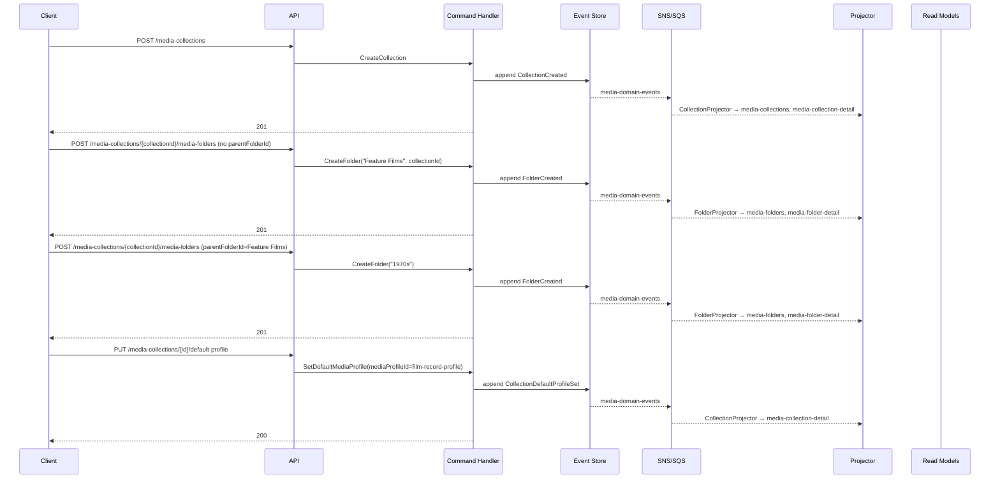
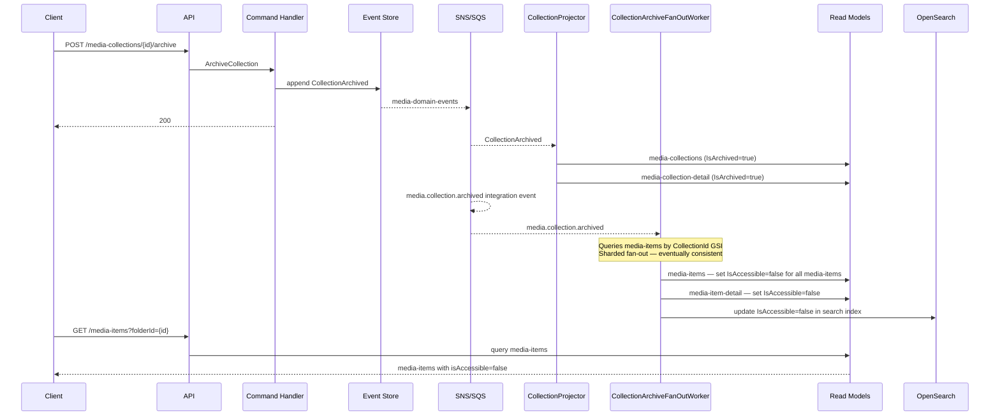

# Collection — Business Scenarios

_Context: `Catalog` · Aggregate: `Collection`_

---

## Index

| # | Scenario | Key Aggregates |
|---|---|---|
| C-1 | Set Up a Collection Structure | Collection, Folder |
| C-3 | Archive a Collection | Collection, MediaItem |

---

## Diagram Key

```
Client  → API consumer (browser / integration)
API     → Ingest API or Query API Lambda
CH      → Command Handler Lambda
ES      → Event Store (DynamoDB media-events)
Bus     → SNS topic + SQS fan-out
Proj    → Projector Lambda(s)
RM      → Read Model DynamoDB tables
OS      → OpenSearch
```

Arrows: `→` command/request/event dispatch · `-->>` async / response

---

## C-1: Set Up a Collection Structure

**Context:** An owner creates a film archive media-collection with a media-folder hierarchy and sets a default MediaProfile.

**Steps:**

1. `POST /media-collections` → `CreateCollection` → `CollectionCreated`
2. `POST /media-collections/{collectionId}/media-folders` (no `parentFolderId`) → `CreateFolder("Feature Films", collectionId)` → `FolderCreated` (null `ParentFolderId` signals root media-folder; media-collection membership is derived from `CollectionId` on the media-folder, not from an event on the Collection aggregate)
3. `POST /media-collections/{collectionId}/media-folders` (`parentFolderId = Feature Films`) → `CreateFolder("1970s")` → `FolderCreated` (parent aggregate not mutated; child relationship reflected in `media-folders` read model by `ParentFolderId`)
4. `PUT /media-collections/{collectionId}/default-profile` → `SetDefaultMediaProfile` pointing to a published `FilmRecord` MediaProfile → `CollectionDefaultProfileSet`

**Key invariants:**
- Root media-folder membership is tracked at the Folder level: a Folder with `ParentFolderId = null` and a non-null `CollectionId` is a root media-folder of that Collection. The Collection aggregate is not mutated when a media-folder is created.
- Child media-folder relationships are read-model only: `media-folders` is queried by `ParentFolderId`.
- Maximum media-folder depth is 10 levels. A `409` is returned if the depth invariant would be violated.



---

## C-3: Archive a Collection

**Context:** Owner archives a media-collection. Write-side aggregates are untouched; only read models suppress accessibility via a fan-out projection.

**Steps:**

1. `POST /media-collections/{collectionId}/archive` → `ArchiveCollection` → `CollectionArchived`
2. `CollectionProjector` sets `IsArchived = true` on `media-collections` and `media-collection-detail`
3. `CollectionArchiveFanOutWorker` (separate Lambda, triggered by `media.collection.archived` integration event) queries `media-items` by `CollectionId` GSI, and sets `IsAccessible = false` on all media-items in `media-items`, `media-item-detail`, and OpenSearch in sharded batches
4. `GET /media-items?folderId={id}` returns media-items with `isAccessible = false`
5. Write-side aggregates (Folder, MediaItem, Asset) are untouched and remain fully intact

> **Note:** `UnarchiveCollection` is not defined in v1. Restoration requires a future command addition.

**Key invariants:**
- No write-side cascade — this is projection-only suppression.
- `CollectionArchived` triggers independent fan-out: `CollectionProjector` and `MediaItemProjector` both consume it.
- `IsAccessible` update is eventually consistent — a narrow window exists where newly written media-items may not yet reflect the flag.
- `CollectionArchiveFanOutWorker` uses sharding to avoid DynamoDB hot partition on large media-collections.



---

## Related

- [Catalog Context Overview](../../context-overview.md)
- [Collection Write Model](collection.write-model.md)
- [Folder Write Model](../Folder/folder.write-model.md)
- [MediaItem Scenarios](../MediaItem/mediaitem.scenarios.md)
- [MediaProfile Scenarios](../MediaProfile/mediaprofile.scenarios.md)
