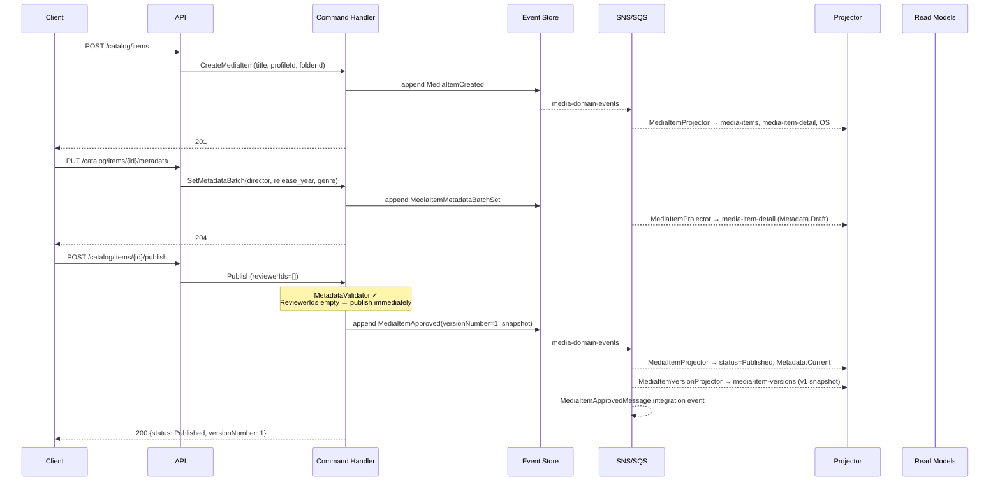
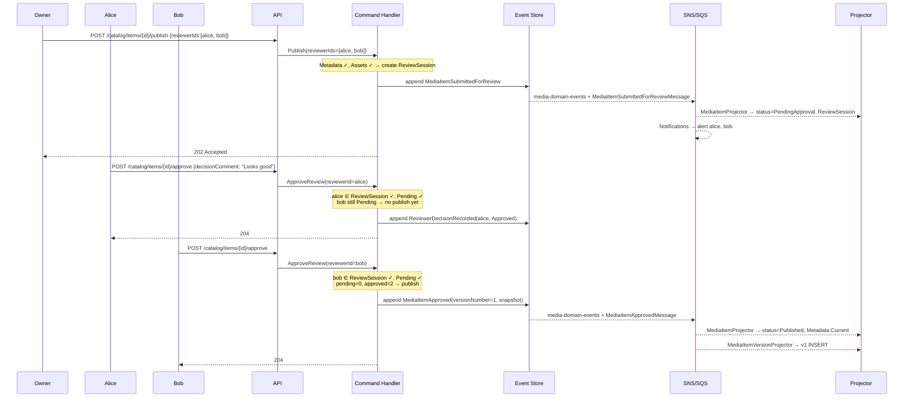
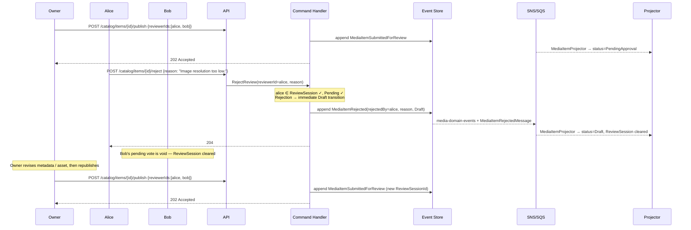
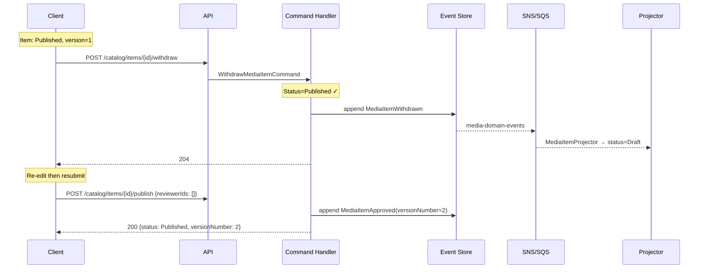
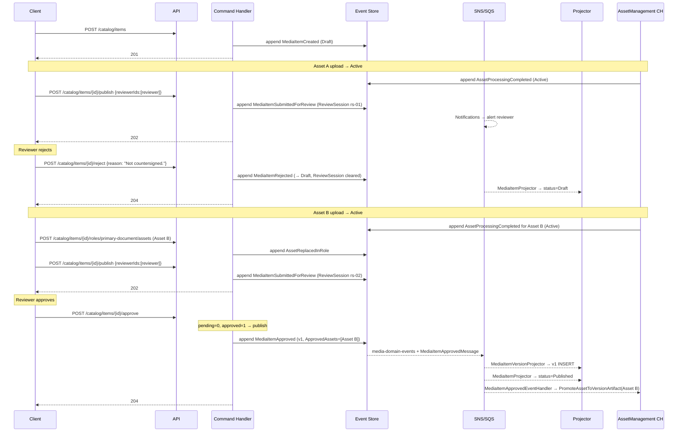

# MediaItem — Business Scenarios

_Context: `Catalog` · Aggregate: `MediaItem`_

---

## Index

| # | Scenario | Key Aggregates |
|---|---|---|
| C-2 | Publish a MediaItem (No Reviewers — Auto-Approve) | MediaItem |
| C-3 | Publish a MediaItem (With Reviewers — All Approve) | MediaItem |
| C-4 | Publish a MediaItem (One Reviewer Rejects — Back to Draft) | MediaItem |
| C-5 | Cross-Collection MediaItem Move | MediaItem, Folder |
| C-6 | Withdraw While Pending Approval | MediaItem |
| C-7 | Reviewer Not in Session Tries to Vote | MediaItem |
| C-8 | Reviewer Votes Twice | MediaItem |
| MW-1 | MediaItem Withdrawal (Published → Draft) | MediaItem |
| MW-2 | MediaItem Direct Archive (Individual) | MediaItem |
| MW-3 | First Folder Assignment from Unassigned Pool | MediaItem, Folder |
| MW-6 | Metadata Validation Failure at Publish | MediaItem |
| MW-7 | Browse Unassigned Pool | MediaItem |
| BULK-2 | Bulk Metadata Update Across MediaItems | MediaItem |
| MI-1 | Simple Version Increment with Asset Pipeline | MediaItem, Asset (cross-context) |
| MI-2 | Review Rejection then Approval | MediaItem, Asset, MediaChangeRequest (cross-context) |
| BR-1 | Begin Revision and Publish New Version | MediaItem |
| BR-2 | Begin Revision and Discard | MediaItem |

**Cross-context scenarios** involving MediaItem:
- Comment Thread on Review → see [ChangeRequests context](../../../ChangeRequests/business-scenarios.md)
- Contract Signing Workflow → see [DocumentSigning context](../../../DocumentSigning/business-scenarios.md)
- Upload and Process a Media Asset → see [AssetManagement context](../../../AssetManagement/business-scenarios.md)
- Authorization Rejection Scenarios (PERM-1, PERM-2, PERM-3) → see [Shared Security Scenarios](../../../../../shared/security-scenarios.md)

---

## Diagram Key

```
Client  → API consumer (browser / integration)
API     → Ingest API or Query API Lambda
CH      → Command Handler Lambda
ES      → Event Store (DynamoDB media-events)
Bus     → SNS topic + SQS fan-out
Proj    → Projector Lambda(s)
RM      → Read Model DynamoDB tables
OS      → OpenSearch
AM      → AssetManagement Command Handler
```

Arrows: `→` command/request/event dispatch · `-->>` async / response

---

## C-2: Publish a MediaItem (No Reviewers — Immediate Publish)

**Context:** Owner populates metadata and publishes with no reviewers. The item publishes immediately and transitions directly to `Published` in a single synchronous command.

**Steps:**

1. `POST /catalog/items` → `CreateMediaItem({title: "Chinatown (1974)", mediaProfileId, folderId})` → `MediaItemCreated` (status → `Draft`)
2. `PUT /catalog/items/{id}/metadata` → `SetMetadataBatch({director, release_year, genre})` → `MediaItemMetadataBatchSet` (written to `Metadata.Draft`)
3. `POST /catalog/items/{id}/publish` — body: `{}` (no reviewerIds) → `PublishMediaItemCommand(reviewerIds: [])` → handler validates metadata + assets → `MediaItemApproved({newVersionNumber: 1, ...})` raised inline. `Metadata.Draft` promoted to `Metadata.Current`. `MediaItemVersionProjector` writes snapshot.

**Key invariants:**
- Empty or absent `reviewerIds` → immediate publish. No `ReviewSession` created.
- `MetadataValidator` resolves schema from the pinned `RecordTypeVersion` — not the latest published version.
- `SetMetadataBatch` always writes to `Metadata.Draft`. `Metadata.Current` is only updated by `MediaItemApproved`.
- Response is `200 OK` with `{ "status": "Published", "versionNumber": 1 }`.



---

## C-3: Publish a MediaItem (With Reviewers — All Approve)

**Context:** Owner publishes with two reviewers. Item enters `PendingApproval`. Both approve in sequence. When the last approval lands, the item publishes automatically.

**Steps:**

1. `POST /catalog/items/{id}/publish` — body: `{ "reviewerIds": ["user_alice", "user_bob"] }` → `MediaItemSubmittedForReview` (Draft → PendingApproval). `ReviewSession` created with Alice and Bob both `Pending`.
2. Response: `202 Accepted`.
3. Alice: `POST /catalog/items/{id}/approve` → `ApproveReviewCommand(reviewerId: alice)` → reviewer decision recorded. Bob still `Pending` → no publication yet. `204 No Content`.
4. Bob: `POST /catalog/items/{id}/approve` → `ApproveReviewCommand(reviewerId: bob)` → all non-withdrawn reviewers approved → `MediaItemApproved({newVersionNumber: 1})` raised. `ReviewSession` cleared. `200 OK` or `204 No Content`.

**Key invariants:**
- Each reviewer calls the same `/approve` endpoint — no saga, no MCR gating.
- Publication fires only when all non-withdrawn reviewers have `Approved`.
- `Metadata.Current` is promoted atomically with the `MediaItemApproved` event.
- The `202 Accepted` response includes `commentThreadId` — the pre-generated `ChangeRequestId` for the linked comment thread. Use `POST /v1/change-requests/{commentThreadId}/comments` to post review comments. See [CRC-6](../../../ChangeRequests/aggregates/MediaChangeRequest/mediachangerequest.scenarios.md#crc-6-reviewer-participant-adds-comment--succeeds).



---

## C-4: Publish a MediaItem (One Reviewer Rejects — Back to Draft)

**Context:** Owner publishes with two reviewers. Item enters `PendingApproval`. Alice rejects immediately. Item returns to `Draft`. `ReviewSession` cleared. Owner revises and republishes.

**Steps:**

1. `POST /catalog/items/{id}/publish` — body: `{ "reviewerIds": ["user_alice", "user_bob"] }` → `MediaItemSubmittedForReview` (Draft → PendingApproval). `202 Accepted`.
2. Alice: `POST /catalog/items/{id}/reject` — body: `{ "reason": "Image resolution too low." }` → `RejectReviewCommand(reviewerId: alice, reason)` → `MediaItemRejected` (PendingApproval → Draft). `ReviewSession` cleared immediately. Bob no longer has a pending vote.
3. Owner corrects metadata / replaces asset.
4. Owner: `POST /catalog/items/{id}/publish` — new review cycle. May include same or different reviewers.

**Key invariants:**
- Any single rejection immediately returns item to `Draft` — Bob's pending vote is discarded.
- Draft metadata is preserved across rejection — `Metadata.Draft` is not cleared.
- `ReviewSession` is cleared on rejection. The next submit starts a fresh `ReviewSession` with a new `ReviewSessionId`.
- `reason` is required for rejection.



---

## C-5: Cross-Collection MediaItem Move

**Context:** An item is moved from one folder to another in a different collection. `CollectionId` is re-derived from the target folder at move time. Item status unchanged.

**Steps:**

1. Item state: `Published`, `FolderId = fld-films-70s`, `CollectionId = col-film-archive`.
2. `PUT /catalog/items/{id}/folder` → `MoveMediaItem({folderId: "fld-docs-2026"})` — target folder is in `col-documentary-archive`.
3. Handler validates: target folder exists, not archived; differs from current. `CollectionId` re-derived.
4. `MediaItemMoved({oldFolderId, newFolderId, oldCollectionId, newCollectionId})` raised.
5. `MediaItemProjector` updates `media-items`; removes old `FolderItemsIndex` GSI key; inserts new key.

**Key invariants:**
- `CollectionId` is never supplied by caller — always derived from target Folder.
- Cross-collection moves permitted.
- Move does not affect status, metadata, or assets.

---

## C-6: Withdraw While Pending Approval

**Context:** Owner publishes with reviewers, then changes their mind and withdraws before reviewers decide. Review session is cleared. Item returns to Draft.

**Steps:**

1. Item is `PendingApproval` with an active `ReviewSession` (reviewers pending).
2. Owner: `POST /catalog/items/{id}/withdraw` → `WithdrawMediaItemCommand` → `MediaItemWithdrawn` (PendingApproval → Draft). `ReviewSession` cleared. Reviewers' pending votes are discarded.
3. Owner can re-edit and re-publish with a new review cycle.

**Key invariants:**
- `Withdraw` is permitted from both `Published` and `PendingApproval`.
- From `PendingApproval` → Draft directly (no intermediate status).
- `ReviewSession` cleared — next submit starts a fresh session.
- Reviewers are not notified of withdrawal via a domain event; downstream notification is responsibility of integration event consumer.

---

## C-7: Reviewer Not in Session Tries to Vote

**Context:** A user who is not assigned to the active `ReviewSession` attempts to approve. Rejected immediately.

**Preconditions:** Item is `PendingApproval`. Active `ReviewSession` contains Alice and Bob. Carol is not assigned.

**Steps:**

1. Carol: `POST /catalog/items/{id}/approve` → `ApproveReviewCommand(reviewerId: carol)`
2. Handler: Carol not in `ReviewSession.Reviewers` → `DomainError.NotAssignedReviewer`
3. No event written. `403 Forbidden`.

**Error Response:**
```json
{
  "type": "https://errors.magiqmedia.com/domain/not-assigned-reviewer",
  "title": "Not an assigned reviewer",
  "status": 403,
  "detail": "User user_carol is not an assigned reviewer on the active review session.",
  "extensions": { "errorCode": "NotAssignedReviewer" }
}
```

---

## C-8: Reviewer Votes Twice

**Context:** Alice approved earlier. She attempts to approve again. Rejected.

**Preconditions:** Item is `PendingApproval`. Alice's `ReviewerAssignment.Decision = Approved`.

**Steps:**

1. Alice: `POST /catalog/items/{id}/approve` → `ApproveReviewCommand(reviewerId: alice)`
2. Handler: Alice's decision is `Approved` (not `Pending`) → `DomainError.ReviewerAlreadyDecided`
3. No event written. `409 Conflict`.

**Key invariants:**
- Same guard applies to `/reject` — a reviewer who has already decided cannot vote again.
- A reviewer who rejected cannot switch to approve (or vice versa) — decisions are final.

---

## MW-1: MediaItem Withdrawal (Published → Draft)

**Context:** Owner withdraws a published item to correct an error before re-publishing.

**Pre-condition:** Item is `Published`.

**Steps:**

1. `POST /catalog/items/{id}/withdraw` → `WithdrawMediaItemCommand` → `MediaItemWithdrawn` (Published → Draft).
2. Owner edits metadata or replaces assets.
3. `POST /catalog/items/{id}/publish` → immediate publish or pending approval path.

**Key invariants:**
- Only `Published` and `PendingApproval` items can be withdrawn.
- `Withdraw` on `Draft` or `Archived` returns `409`.
- `Metadata.Current` from the last approved version is preserved and accessible via `GET /catalog/items/{id}/versions/{n}`.
- No version snapshot created at withdrawal time.



---

## MW-2: MediaItem Direct Archive (Individual)

**Context:** Owner archives a single item — for example, a draft that will never be published. Terminal state.

**Pre-condition:** Item is in `Draft`, `Published`, or `PendingApproval`. Not in an active signing session.

**Steps:**

1. `POST /catalog/items/{id}/archive` → `ArchiveMediaItemCommand` → `MediaItemArchived` (→ Archived, terminal).
2. All subsequent write commands return `409`.

**Key invariants:**
- `Archived` is terminal — no further commands accepted.
- Archive permitted from `Draft`, `Published`, `PendingApproval`. `Archived` items cannot be re-archived.
- Assets assigned to roles are not deleted — they retain their own lifecycle.

---

## MW-3: First Folder Assignment from Unassigned Pool

**Context:** A MediaItem created without a folder is assigned to one for the first time. One-way, irreversible.

**Steps:**

1. `POST /catalog/items` → `CreateMediaItemCommand({title, mediaProfileId})` → `MediaItemCreated` (FolderId = null).
2. `PUT /catalog/items/{id}/folder` → `AssignMediaItemToFolderCommand({folderId: "fld-films-70s"})` → `MediaItemAssignedToFolder({folderId, collectionId})`.
3. `MediaItemProjector` sets `FolderId` and `CollectionId`; removes from `UnassignedIndex` GSI.

**Key invariants:**
- `FolderId` cannot return to `null` after assignment — structural invariant.
- Subsequent folder changes use `MoveMediaItem`, not `AssignMediaItemToFolder`.
- `CollectionId` always derived from target folder — never caller-supplied.

---

## MW-6: Metadata Validation Failure at Publish (422)

**Context:** Owner attempts to submit but draft metadata is incomplete. Validator rejects before any event is written.

**Pre-conditions:** Item in `Draft`. `FilmRecord v4` schema requires `title`, `release_date`, `runtime_minutes`. Owner set `title` but left `release_date` absent and `runtime_minutes = 0`.

**Steps:**

1. `PUT /catalog/items/{id}/metadata` → `SetMetadataBatch({title: "Chinatown", runtime_minutes: 0})` → `MediaItemMetadataBatchSet`. Returns `204` — metadata writes are not validated at write time.
2. `POST /catalog/items/{id}/publish` → `Publish`.
3. `MetadataValidator` resolves schema from pinned `RecordTypeVersion`. Fails: `release_date` absent; `runtime_minutes = 0` out of range.
4. `DomainError.MetadataValidationFailed` → `422 Unprocessable Entity`. No event written.

**Expected response:**
```json
{
  "type": "https://errors.magiqmedia.com/validation/metadata-invalid",
  "title": "Metadata validation failed",
  "status": 422,
  "errors": [
    { "fieldName": "release_date", "code": "required", "message": "release_date is required by RecordType FilmRecord v4." },
    { "fieldName": "runtime_minutes", "code": "out_of_range", "message": "runtime_minutes must be between 1 and 99999." }
  ]
}
```

**Key invariants:**
- Metadata writes are not validated against RecordType schema — partial drafts always accepted.
- All failing fields reported in a single response — not short-circuited.
- No event written on failure — aggregate unchanged.

---

## MW-7: Browse Unassigned Pool

**Context:** MediaItems sit in the unassigned pool (`FolderId = null`) until assigned. Owner discovers and paginates them.

**Steps:**

1. `GET /catalog/items?unassigned=true` → reads `UnassignedIndex` GSI → returns first page.
2. `GET /catalog/items?unassigned=true&status=Draft` → filtered.
3. `GET /catalog/items?unassigned=true&pageToken={token}` → paginated.
4. Owner selects item → assigns to folder (see MW-3).

**Key invariants:**
- Results scoped to authenticated owner's tenant — `TenantId` from JWT.
- Eventual consistency applies from `MediaItemCreated` projection.

---

## BULK-2: Bulk Metadata Update Across MediaItems

**Context:** Editor applies the same metadata fields to multiple items in one request. Per-item failures collected without blocking others.

**Steps:**

1. `POST /catalog/items/bulk/metadata` — body: `{ "itemIds": ["mi-01", "mi-02", "mi-03"], "fields": { "campaign": "Q1-2026" }, "onError": "ContinueOnError" }`
2. Handler processes in parallel:
   - mi-01, mi-02: field resolved → `MediaItemMetadataBatchSet` × 2
   - mi-03: `campaign` not in schema → `BulkItemError { errorCode: "FieldNotFound" }`
3. `207 Multi-Status`

**Key invariants:**
- Full-replace semantics per item — omitting a field clears it.
- Each item independent with `ContinueOnError`.
- Max 100 items per request.

---

## MI-1: Simple Version Increment with Asset Pipeline

**Context:** Published item ("Annual Report 2024") at v1. Owner replaces cover image and republishes. No reviewers.

**Steps:**

1. `PUT /catalog/items/{id}/metadata` — item is `Published`. First write auto-raises nothing (no auto-revert in simplified lifecycle — see note below). `MediaItemMetadataBatchSet` written to `Metadata.Draft`. Status remains `Published`.

> **Note on write behaviour:** In the simplified lifecycle, writing to a `Published` item does not auto-revert to `Draft`. The item stays `Published` while draft edits accumulate. The item only changes status when explicitly published (`Publish`) or withdrawn (`Withdraw`).

2. Asset upload → validation → processing → `AssetProcessingCompleted` (status → Active).
3. `POST /catalog/items/{id}/roles/cover-image/assets` → `ReplaceAssetInRole` → `AssetReplacedInRole`.
4. `POST /catalog/items/{id}/publish` (no reviewers) → `PublishMediaItemCommand(reviewerIds: [])` → validates metadata + assets → `MediaItemApproved({newVersionNumber: 2, ApprovedAssets})`. `Metadata.Draft` → `Metadata.Current`. Status → `Published`. `MediaItemVersionProjector` inserts v2.
5. `MediaItemApprovedEventHandler` (AssetManagement) promotes new cover-image asset to `VersionArtifact`.

**Key invariants:**
- `ReviewPolicy` field removed — reviewer count in `Publish` drives path, not profile config.
- `ApproveReviewHandler` (not a saga) calls `IAssetQueryService.GetManyAsync` to snapshot S3 keys.
- `PromoteAssetToVersionArtifact` dispatched by `MediaItemApprovedEventHandler` in AssetManagement.

---

## MI-2: Review Rejection then Approval

**Context:** Compliance officer submits a contract for review. First submission rejected (unsigned). Owner uploads countersigned version, resubmits. Second submission approved and published at v1.

**Steps:**

1. `POST /catalog/items` → `MediaItemCreated` (Draft)
2. Asset A uploaded, validated, activated.
3. `POST /catalog/items/{id}/roles/primary-document/assets` → `AssetAssignedToRole(A)`.
4. `POST /catalog/items/{id}/publish` — body: `{ "reviewerIds": ["reviewer@org.com"] }` → `MediaItemSubmittedForReview` (Draft → PendingApproval). `ReviewSession` created.
5. Reviewer: `POST /catalog/items/{id}/reject` — body: `{ "reason": "Not countersigned." }` → `MediaItemRejected` (PendingApproval → Draft). `ReviewSession` cleared.
6. Owner uploads Asset B (countersigned), validates, activates. Replaces primary-document role.
7. `POST /catalog/items/{id}/publish` — body: `{ "reviewerIds": ["reviewer@org.com"] }` → `MediaItemSubmittedForReview` (Draft → PendingApproval). New `ReviewSession` (new `ReviewSessionId`).
8. Reviewer: `POST /catalog/items/{id}/approve` → all non-withdrawn reviewers approved → `MediaItemApproved({newVersionNumber: 1, ApprovedAssets: [Asset B]})`. Status → Published.
9. `MediaItemVersionProjector` inserts v1. `MediaItemApprovedEventHandler` promotes Asset B to `VersionArtifact`.

**Key invariants:**
- Asset A never promoted to `VersionArtifact` — only `MediaItemApproved` assets are promoted.
- Two review cycles, two `ReviewSession` objects (different `ReviewSessionId`).
- Draft metadata preserved across rejection — owner can revise without starting from scratch.
- `ApproveReviewHandler` calls `IAssetQueryService.GetManyAsync` to snapshot Asset B's S3 key at approval time.



---

## BR-1: Begin Revision and Publish New Version

**Context:** Owner begins a revision on a Published item (v1), edits draft content, and publishes without reviewers. A new version (v2) is created.

**Pre-condition:** Item is `Published`, `CurrentVersionNumber = 1`.

**Steps:**

1. `POST /catalog/items/{id}/begin-revision` → `BeginRevisionCommand` → `MediaItemRevisionStarted` (Published → Revising). `Metadata.Draft` seeded from `Metadata.Current`. Published version (v1) remains live.
2. Owner edits: `PUT /catalog/items/{id}/metadata` → `MediaItemMetadataBatchSet` (writes to `Metadata.Draft`). Status remains `Revising`.
3. `POST /catalog/items/{id}/publish` (no reviewers) → `PublishMediaItemCommand(reviewerIds: [])` → validates metadata + assets → `MediaItemApproved({newVersionNumber: 2, ...})`. Status → `Published`. `Metadata.Draft` promoted to `Metadata.Current`.

**Key invariants:**
- `Status` remains `Revising` during edits — published version continues to serve readers.
- `CurrentVersionNumber` is unchanged at `1` until `MediaItemApproved` fires.
- Publish from `Revising` follows the same path as from `Draft` (immediate or pending-approval).
- Response: `200 OK` with `{ "status": "Published", "versionNumber": 2 }`.

---

## BR-2: Begin Revision and Discard

**Context:** Owner begins a revision but abandons the draft. Item returns to Published with version unchanged.

**Pre-condition:** Item is `Published`, `CurrentVersionNumber = 1`.

**Steps:**

1. `POST /catalog/items/{id}/begin-revision` → `BeginRevisionCommand` → `MediaItemRevisionStarted` (Published → Revising). `Metadata.Draft` seeded from `Metadata.Current`.
2. Owner makes draft edits (optional).
3. `POST /catalog/items/{id}/discard-revision` → `DiscardRevisionCommand` → `MediaItemRevisionDiscarded`. `Metadata.Draft` cleared. Status → `Published`. `CurrentVersionNumber` remains `1`.

**Key invariants:**
- No version snapshot is created on discard — version counter is unchanged.
- Published content (`Metadata.Current`) is not modified by the discard operation.
- Item is immediately editable again via a new `BeginRevision` call.

---

## Related

- [Catalog Context Overview](../../context-overview.md)
- [MediaItem Write Model](mediaitem.write-model.md)
- [MediaItem API](mediaitem.api.md)
- [Collection Scenarios](../Collection/collection.scenarios.md)
- [MediaProfile Scenarios](../MediaProfile/mediaprofile.scenarios.md)
- [ChangeRequests Business Scenarios](../../../ChangeRequests/business-scenarios.md) — comment threads on reviews
- [DocumentSigning Business Scenarios](../../../DocumentSigning/business-scenarios.md) — contract signing
