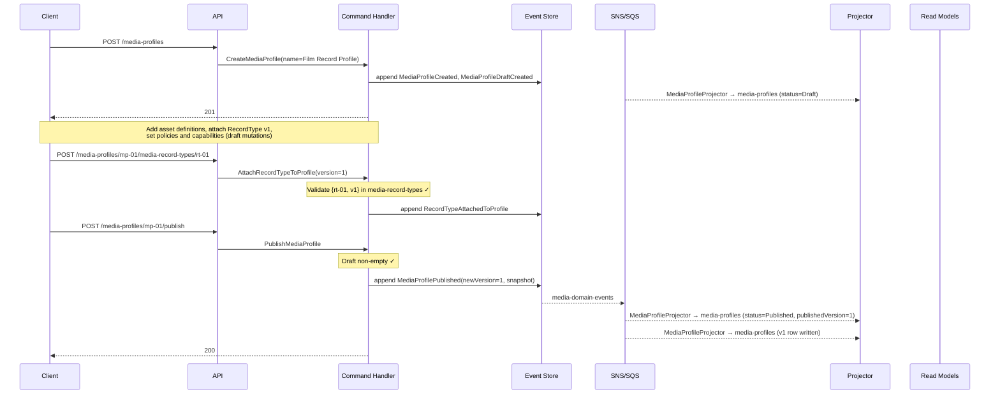
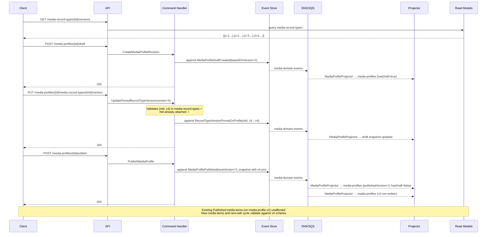

# MediaProfile — Business Scenarios

_Context: `Catalog` · Aggregate: `MediaProfile`_

---

## Index

| # | Scenario | Key Aggregates |
|---|---|---|
| MP-1 | Create and Publish a MediaProfile | MediaProfile |
| MP-2 | Re-pin a MediaProfile to a New RecordType Version | MediaProfile |
| MP-3 | Deprecate a MediaProfile | MediaProfile |

---

## Diagram Key

```
Client  → API consumer (browser / integration)
API     → Ingest API or Query API Lambda
CH      → Command Handler Lambda
ES      → Event Store (DynamoDB media-events)
Bus     → SNS topic + SQS fan-out
Proj    → Projector Lambda(s)
RM      → Read Model DynamoDB tables
```

Arrows: `→` command/request/event dispatch · `-->>` async / response

---

## MP-1: Create and Publish a MediaProfile

**Context:** An owner creates a new `FilmRecord` media-profile, attaches asset definitions and a published RecordType schema, and publishes it so MediaItems can be assigned to it.

**Pre-condition:** `FilmRecord` RecordType v1 already exists in `media-record-types` (see [Metadata Business Scenarios — M-1](../../../Metadata/business-scenarios.md)).

**Steps:**

1. `POST /media-profiles` → `CreateMediaProfile({name: "Film Record Profile"})` → `MediaProfileCreated` + `MediaProfileDraftCreated({basedOnVersion: null})`
2. `POST /media-profiles/mp-01/asset-definitions` → `AddAssetDefinition({roleName: "primary-image", acceptedContentTypes: ["Image"], isRequired: true})` → `AssetDefinitionAdded`
3. `POST /media-profiles/mp-01/asset-definitions` → `AddAssetDefinition({roleName: "trailer", acceptedContentTypes: ["Video"], isRequired: false, maxFileSizeBytes: 524288000})` → `AssetDefinitionAdded`
4. `POST /media-profiles/mp-01/media-record-types/rt-01` → `AttachRecordType({version: 1})` → validates `{rt-01, v1}` in `media-record-types` ✓ → `RecordTypeAttachedToProfile`
5. `PUT /media-profiles/mp-01/review-policy` → `SetReviewPolicy({reviewPolicy: "None"})` → `ReviewPolicySet`
6. `PUT /media-profiles/mp-01/capabilities` → `SetCapabilities({capabilities: ["Processing", "VersionControl", "Registration"]})` → `MediaProfileCapabilitiesSet`
7. `POST /media-profiles/mp-01/publish` → `PublishMediaProfile` → `MediaProfilePublished({newVersion: 1, snapshot: {...}})`. Status `Draft → Published`. MediaItems may now be assigned to this media-profile.

**Key invariants:**
- `AttachRecordType` validates against `media-record-types` — draft RecordType versions cannot be pinned.
- Capabilities are configuration, not runtime state — they take effect only on media-profile publish.
- Only `Published` media-profiles can be assigned to new MediaItems.



---

## MP-2: Re-pin a MediaProfile to a New RecordType Version

**Context:** A MediaProfile is currently at published v2, pinned to `{rt-01, version: 3}`. RecordType rt-01 is now at v4 (added `release_date`, removed `release_year`). The media-profile needs to be updated so that new MediaItems and next-edit cycles validate against the v4 schema.

**Steps:**

1. `GET /media-record-types/{recordTypeId}/versions` → confirms v4 is available.
2. `POST /media-profiles/{mediaProfileId}/draft` → `CreateMediaProfileRevision` → `MediaProfileDraftCreated({basedOnVersion: 2})`. Draft opens with a copy of the published v2 state.
3. `PUT /media-profiles/{mediaProfileId}/media-record-types/{recordTypeId}/version` → `UpdatePinnedRecordTypeVersion({version: 4})` → validates `{rt-01, v4}` exists ✓ → `RecordTypeVersionPinnedOnProfile`. Draft now pins `{rt-01, v4}`.
4. `POST /media-profiles/{mediaProfileId}/publish` → `PublishMediaProfile` → `MediaProfilePublished({newVersion: 3, snapshot: {..., recordTypes: [{recordTypeId, pinnedVersion: 4}]}})`. New MediaItems created after this publish will validate against the v4 schema.
5. Existing `Published` MediaItems (on v2 of this media-profile) are not affected mid-lifecycle — their `Metadata.Current` was validated against the v3 schema at approval time and remains valid.
6. When an existing media-item is next edited and resubmitted, `SubmitForReview` will validate `Metadata.Draft` against the v4 schema. Any `release_year` value in draft will fail validation — the owner must populate `release_date` first.

**Key invariants:**
- `UpdatePinnedRecordTypeVersion` only applies to an already-attached RecordType.
- The new pinned version must exist in `media-record-types` (published versions only).
- Schema governance is forward-only. Published MediaItems already in `Metadata.Current` are not retroactively revalidated.



---

## MP-3: Deprecate a MediaProfile

**Context:** Admin deprecates a profile that is no longer fit for new MediaItems. Existing MediaItems using the profile are unaffected. The profile name is freed for reuse.

**Preconditions:** MediaProfile in `Published` status; no active draft open.
**Actor:** Owner (`caller.owner_id == mediaProfile.OwnerId`)
**Trigger:** `POST /v1/catalog/profiles/{profileId}/deprecate`

### Steps

1. Admin: `POST /v1/catalog/profiles/mp-01/deprecate`
   - `DeprecateMediaProfileCommand(TenantId, mp-01, OccurredAt)`
   - Handler loads profile — `Status = Published` ✅, `Draft = null` ✅
   - `MediaProfile.Deprecate(OccurredAt)` → collects `DefaultAssetIds` from `AssetDefinitions`
   - `MediaProfileDeprecated { MediaProfileId: mp-01, DeprecatedAt, DefaultAssetIds: [asset-07] }`
   - Handler: `NameReservationService.ReleaseAsync("Film Record Profile")` — name freed
   - Handler: `repository.SaveAsync(profile)`
   - `→ 202 Accepted`

2. Projector: `MediaProfileDetailProjector` receives `MediaProfileDeprecated`
   - `media-profiles` read model → `status = Deprecated`

3. Integration event: `MediaProfileDeprecatedIntegrationEvent { TenantId, MediaProfileId: mp-01, DeprecatedAt, DefaultAssetIds: [asset-07] }`
   → published to `media-integration-events` SNS

4. AssetManagement: `MediaProfileDeprecatedEventHandler` fans out one `AssetProfileDefaultChangedEvent(IsAdded: false)` per `DefaultAssetId`
   → `AssetProfileDefaultReferenceProjector` removes profile from the `AssetProfileDefaultReference` inverted index

5. Subsequent `POST /v1/catalog/items` with `mediaProfileId: mp-01`
   - `CreateMediaItemHandler` reads `media-profiles` → `status = Deprecated`
   - Returns `409 MediaProfileDeprecated` — assignment blocked

6. Existing MediaItems with `MediaProfileId = mp-01` continue to function:
   - Checkout, checkin, metadata edits, review — no impact
   - Profile capabilities remain resolved from the read model until item is archived

### Key Invariants

- `Deprecated` is terminal — no re-publication, no new drafts
- Name released immediately — can be claimed by a new profile
- `DefaultAssetIds` in the integration event is the exhaustive list needed by AssetManagement for index cleanup; profiles with no defaults produce an empty list (no-op fan-out)
- Existing MediaItems are NOT migrated to a new profile — ownership of active items is the admin's responsibility before deprecating
- Blocking is enforced at `CreateMediaItem` handler, not at the profile level — the profile aggregate does not track assigned MediaItems

### Error Paths

```
POST /v1/catalog/profiles/mp-draft/deprecate   (Status = Draft, never published)
→ 409 MediaProfileNotPublished

POST /v1/catalog/profiles/mp-01/deprecate      (active draft open)
→ 409 DraftInProgress
```

---

## Related

- [Catalog Context Overview](../../context-overview.md)
- [MediaProfile Write Model](mediaprofile.write-model.md)
- [MediaItem Scenarios](../MediaItem/mediaitem.scenarios.md)
- [Metadata Business Scenarios](../../../Metadata/business-scenarios.md) — RecordType schema evolution
