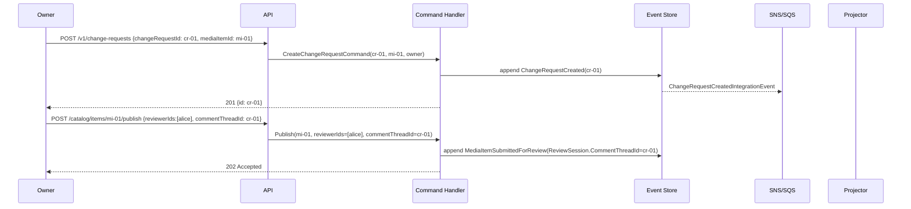

# MediaChangeRequest — Business Scenarios

_Context: `ChangeRequests` · Aggregate: `MediaChangeRequest`_

---

## Overview

`MediaChangeRequest` is a comment thread for a MediaItem review cycle. It carries no lifecycle status and has no reviewer roster. These scenarios cover thread creation and comment management only. For review decision scenarios (approve/reject), see [MediaItem Business Scenarios](../../../Catalog/aggregates/MediaItem/mediaitem.scenarios.md).

---

## Index

| # | Scenario | Key Aggregates |
|---|---|---|
| CRC-1 | Create a Comment Thread for a Review | MediaChangeRequest, MediaItem |
| CRC-2 | Add a Comment | MediaChangeRequest |
| CRC-3 | Edit Own Comment | MediaChangeRequest |
| CRC-4 | Delete Own Comment | MediaChangeRequest |
| CRC-5 | Non-Author Cannot Edit Another User's Comment | MediaChangeRequest |
| CRC-6 | Reviewer (Participant) Adds Comment — Succeeds | MediaChangeRequest |
| CRC-7 | Non-Participant Tries to Add Comment — 403 Forbidden | MediaChangeRequest |

---

## Diagram Key

```
Client  → API consumer (browser / integration)
API     → Ingest API or Query API Lambda
CH      → Command Handler Lambda
ES      → Event Store (DynamoDB media-events)
Bus     → SNS topic + SQS fan-out
Proj    → Projector Lambda(s)
RM      → Read Model DynamoDB tables
```

Arrows: `→` command/request/event dispatch · `-->>` async / response

---

## CRC-1: Create a Comment Thread for a Review

**Context:** Owner publishes a MediaItem with reviewers and creates a comment thread so reviewers can leave structured feedback. The `commentThreadId` is passed into `Publish` to link the thread to the review session.

**Steps:**

1. Owner pre-generates `changeRequestId = "cr-01"` (UUID v7).
2. Owner: `POST /v1/change-requests` — body: `{ "changeRequestId": "cr-01", "mediaItemId": "mi-01" }` → `CreateChangeRequestCommand` → `ChangeRequestCreated { ChangeRequestId: cr-01, MediaItemId: mi-01 }` → `201 Created`.
3. Owner: `POST /catalog/items/mi-01/publish` — body: `{ "reviewerIds": ["user_alice"], "commentThreadId": "cr-01" }` → `MediaItemSubmittedForReview { ReviewSession.CommentThreadId: cr-01 }` → `202 Accepted`.
4. Reviewers can now add comments on `cr-01` and cast decisions via `POST /catalog/items/mi-01/approve` or `/reject`.

**Key invariants:**
- Comment thread and submit are independent calls — the thread exists before submit; the link is established by passing `commentThreadId` in the submit body.
- Creating a thread does not start a review — it only provides a comment space.
- Caller must own the linked MediaItem to create the thread.



---

## CRC-2: Add a Comment

**Context:** Reviewer leaves feedback on the comment thread for an active review.

**Preconditions:** Comment thread `cr-01` exists for MediaItem `mi-01`. Alice is an assigned reviewer in the active `ReviewSession`.

**Steps:**

1. Alice: `POST /v1/change-requests/cr-01/comments`
   ```json
   { "commentId": "cm-01", "body": "The title field looks truncated in the metadata." }
   ```
   → `AddCommentCommand(cr-01, cm-01, alice, body, parentCommentId=null)`
   → `ReviewCommentAdded { CommentId: cm-01, AuthorId: alice, Body: "...", ParentCommentId: null }`
   → `ChangeRequestCommentProjector` → INSERT row
   → `201 Created`

2. Owner: `POST /v1/change-requests/cr-01/comments`
   ```json
   { "commentId": "cm-02", "body": "Good catch — will fix before resubmit.", "parentCommentId": "cm-01" }
   ```
   → `ReviewCommentAdded { CommentId: cm-02, ParentCommentId: cm-01 }`
   → `201 Created`

3. `GET /v1/change-requests/cr-01/comments` → flat list ordered by `createdAt`. Client assembles thread using `parentCommentId` links.

**Key invariants:**
- Participant check: caller must be owner or an assigned reviewer (including withdrawn) of the linked MediaItem.
- Non-participants receive `403`.
- Thread structure is client-assembled from `parentCommentId`.

---

## CRC-3: Edit Own Comment

**Context:** Alice wrote a comment with a typo. She corrects it.

**Preconditions:** Comment `cm-01` exists, authored by Alice. Not deleted.

**Steps:**

1. Alice: `PATCH /v1/change-requests/cr-01/comments/cm-01`
   ```json
   { "body": "The title field is truncated after 80 characters." }
   ```
   → `EditCommentCommand(cr-01, cm-01, alice, newBody)`
   → Handler calls `ICommentReadModel.GetBodyAsync(cr-01, cm-01)` → returns current body as `OldBody`
   → `ReviewCommentEdited { CommentId: cm-01, OldBody: "...", NewBody: "...", EditedAt: ... }`
   → `ChangeRequestCommentProjector` → UPDATE `Body`, set `EditedAt`
   → `204 No Content`

2. `GET /v1/change-requests/cr-01/comments/cm-01` → `{ "body": "The title field is truncated after 80 characters.", "editedAt": "..." }`

**Key invariants:**
- Author-only. Another user (including the MediaItem owner) receives `403`.
- `OldBody` preserved in the domain event for audit purposes.
- Cannot edit a deleted comment — returns `404`.

---

## CRC-4: Delete Own Comment

**Context:** Owner posted a reply they want to retract after the review concluded.

**Preconditions:** Comment `cm-02` exists, authored by Owner. Not yet deleted.

**Steps:**

1. Owner: `DELETE /v1/change-requests/cr-01/comments/cm-02`
   → `DeleteCommentCommand(cr-01, cm-02, owner)`
   → `ReviewCommentDeleted { CommentId: cm-02, DeletedAt: ... }`
   → `ChangeRequestCommentProjector` → UPDATE `IsDeleted = true`, `Body = "[deleted]"`, `AuthorId = null`
   → `204 No Content`

2. `GET /v1/change-requests/cr-01/comments` → `cm-02` appears with `{ "isDeleted": true, "body": "[deleted]" }`. Row retained so thread structure stays intact.

**Key invariants:**
- No lifecycle gate — permitted even after review is resolved.
- Soft-delete only — row is never physically removed.
- Author-only. Returns `403` for non-authors.

---

## CRC-5: Non-Author Cannot Edit Another User's Comment

**Context:** Bob attempts to edit Alice's comment. Rejected.

**Preconditions:** Comment `cm-01` authored by Alice. Bob is an assigned reviewer.

**Steps:**

1. Bob: `PATCH /v1/change-requests/cr-01/comments/cm-01` — body: `{ "body": "Updated by Bob." }`
   → `EditCommentCommand(cr-01, cm-01, bob, newBody)`
   → Aggregate guard: `CommentIndex[cm-01].AuthorId == alice != bob` → `DomainError.CommentAuthorMismatch`
   → `403 Forbidden`

**Error Response:**
```json
{
  "type": "https://errors.magiqmedia.com/domain/not-comment-author",
  "title": "Not the comment author",
  "status": 403,
  "detail": "Only the original author of comment cm-01 may edit it.",
  "extensions": { "errorCode": "NotCommentAuthor" }
}
```

**Key invariants:**
- Edit and delete are author-only regardless of role (reviewer, owner, admin).
- `DeleteComment` applies the same authorship guard.

---

## CRC-6: Reviewer (Participant) Adds Comment — Succeeds

**Context:** An assigned reviewer adds feedback to the comment thread. They are a participant (listed in `ParticipantIds` on the `ChangeRequest`), so the aggregate permits the comment.

**Preconditions:** Thread `cr-01` exists. Alice is in `ParticipantIds` (added as reviewer when the MediaItem was published).

**Steps:**

1. Alice: `POST /v1/change-requests/cr-01/comments`
   ```json
   { "commentId": "cm-10", "body": "Resolution is too low for print use." }
   ```
   → `AddCommentCommand(cr-01, cm-10, alice, body, parentCommentId=null)`
   → Aggregate: `IsParticipant(alice) == true` → guard passes
   → `ReviewCommentAdded { CommentId: cm-10, AuthorId: alice, Body: "..." }`
   → `201 Created`

**Key invariants:**
- Participant snapshot (`ParticipantIds`) is fixed at `ChangeRequestCreated` time — includes submitter + all assigned reviewers.
- Participant check is aggregate-side (`IsParticipant`), not handler-side.

---

## CRC-7: Non-Participant Tries to Add Comment — 403 Forbidden

**Context:** A user who is not a participant of the review (not the submitter, not an assigned reviewer) attempts to comment. Rejected by the aggregate guard.

**Preconditions:** Thread `cr-01` exists. Carol is not in `ParticipantIds`.

**Steps:**

1. Carol: `POST /v1/change-requests/cr-01/comments`
   ```json
   { "commentId": "cm-99", "body": "I have opinions too." }
   ```
   → `AddCommentCommand(cr-01, cm-99, carol, body, parentCommentId=null)`
   → Aggregate: `IsParticipant(carol) == false` → `DomainError.Forbidden`
   → `403 Forbidden`

**Error Response:**
```json
{
  "type": "https://errors.magiqmedia.com/domain/forbidden",
  "title": "Forbidden",
  "status": 403,
  "detail": "Only review participants can comment on this thread.",
  "extensions": { "errorCode": "Forbidden" }
}
```

**Key invariants:**
- Non-participants cannot comment regardless of their role in the system (admin, other-team owner, etc.).
- The check uses the `ParticipantIds` snapshot stored on the `ChangeRequest` — it does not re-query the `ReviewSession`.

---

## Related

- [ChangeRequests Context Overview](../../context-overview.md)
- [MediaChangeRequest Write Model](mediachangerequest.write-model.md)
- [MediaChangeRequest API](mediachangerequest.api.md)
- [MediaItem Business Scenarios](../../../Catalog/aggregates/MediaItem/mediaitem.scenarios.md) — review decisions (approve/reject)
