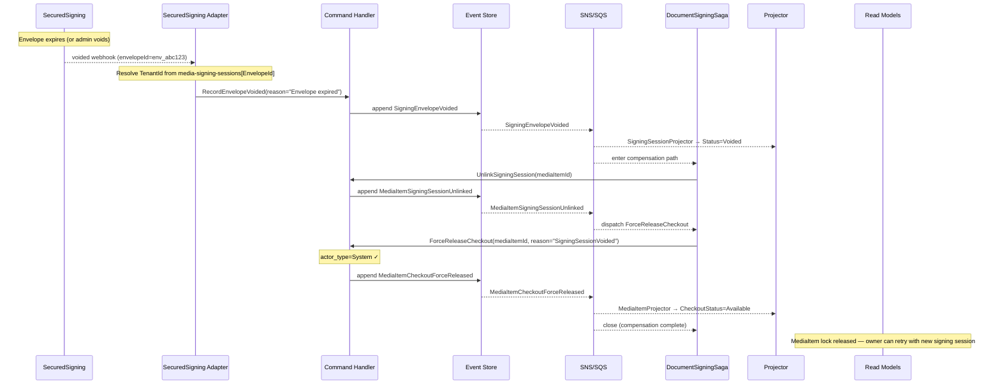
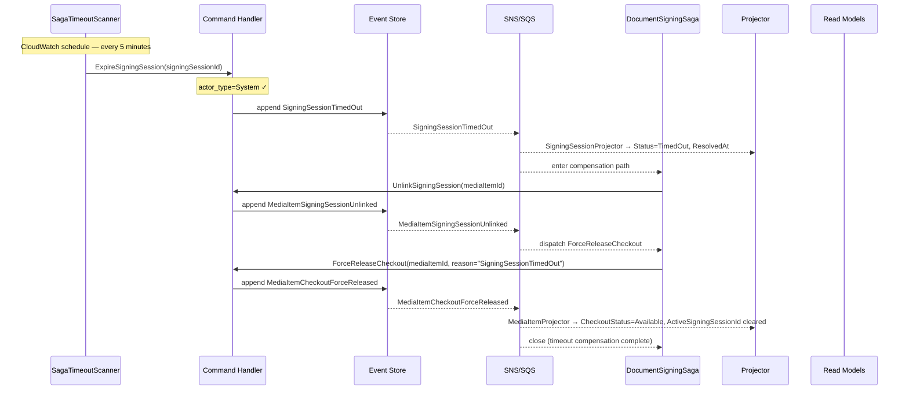

# DocumentSigningSession — Business Scenarios

_Context: `DocumentSigning` · Aggregate: `DocumentSigningSession`_

---

## Index

| # | Scenario | Key Aggregates |
|---|---|---|
| DS-1 | Happy Path — Contract Signed and Published | DocumentSigningSession, MediaItem |
| DS-2 | Envelope Voided (Compensation Path) | DocumentSigningSession, MediaItem |
| DS-3 | Stale Lock — Force Release via Signing Session Timeout | DocumentSigningSession, MediaItem |

---

## Diagram Key

```
Client  → API consumer (browser / integration)
API     → Ingest API or Query API Lambda
CH      → Command Handler Lambda
ES      → Event Store (DynamoDB media-events)
Bus     → SNS topic + SQS fan-out
Saga    → DocumentSigningSaga (SagaOrchestrator Lambda)
SSA     → SecuredSigning Adapter Lambda
SS      → SecuredSigning (external service)
S3      → S3 media-documents bucket
Proj    → Projector Lambda(s)
RM      → Read Model DynamoDB tables
```

Arrows: `→` command/request/event dispatch · `-->>` async / response

---

## DS-1: Happy Path — Contract Signed and Published

**Context:** A MediaItem representing a contract document needs to be signed by two parties (Alice and Bob) before a new version is published. The `DocumentSigningSaga` manages the checkout lock throughout.

**Steps:**

1. Owner checks out the MediaItem: `POST /media-items/{id}/checkout` → `MediaItemCheckedOut`
2. Owner uploads the contract draft, assigns it to the `contract` role (see AssetManagement scenarios)
3. Owner initiates signing: `POST /media-items/{id}/media-signing-sessions` → `InitiateSigningSession({signers: [{alice, routingOrder:1}, {bob, routingOrder:2}]})` → `SigningSessionInitiated`. `DocumentSigningSaga` created.
4. Saga triggers `SecuredSigningAdapter` via `signing-requests` SQS. Adapter calls SecuredSigning API → creates envelope → dispatches `RecordEnvelopeCreated({envelopeId})` → `SigningEnvelopeCreated`. Saga dispatches `LinkSigningSession(mediaItemId, sessionId)` → `MediaItemSigningSessionLinked`. Saga transitions to `AwaitingSigners`.
5. SecuredSigning sends envelope to Alice. Adapter receives webhook: `RecordEnvelopeSent` → `SigningEnvelopeSent`.
6. Alice signs. Adapter receives webhook: `RecordSignerCompleted({email: alice})` → `SignerCompleted(alice)`.
7. Bob signs. Adapter receives webhook: `RecordSignerCompleted({email: bob})` → `SignerCompleted(bob)`. All signers complete → adapter dispatches `RecordSigningCompleted({completionToken})` → `SigningCompleted`.
8. Adapter downloads signed PDF from SecuredSigning, uploads to S3 as new Asset, dispatches `RecordSignedAsset({assetId: signed-asset-01})` → `SignedAssetRecorded`. Saga transitions to `ReleasingLock`.
9. Saga dispatches `UnlinkSigningSession(mediaItemId)` → `MediaItemSigningSessionUnlinked`.
10. Saga dispatches `CheckInMediaItem(mediaItemId)` → `MediaItemCheckedIn`. Lock released. Item remains in `Draft`.
11. Owner assigns signed asset to `contract` role: `POST /catalog/items/{id}/roles/contract/assets` → `AssetAssignedToRole({assetId: signed-asset-01, roleName: "contract"})` → `AssetAssignedToRole`
12. Owner submits and approves: `POST /media-items/{id}/submit-for-review` → `POST /media-items/{id}/approve` → `MediaItemApproved({newVersionNumber: 2})`

**Key invariants:**
- `UnlinkSigningSession` must be dispatched before `CheckInMediaItem` — separate commands by the saga.
- `ForceReleaseCheckout` is used in compensation paths because the saga has no user identity for `CheckedOutBy` validation.
- The signed asset is created by the `SecuredSigningAdapter`, not the saga.
- `CompletionToken` is validated aggregate-side in `RecordSigningCompleted`.

**Postman test notes — polling strategy (R-41):**

Steps 4–10 are webhook-driven (SecuredSigning callbacks) and cannot be driven synchronously by a Postman media-collection run. Poll signing session and MediaItem state at each observable boundary:

| Step | Poll Endpoint | Field | Expected Value | Max Retries | Interval | Notes |
|---|---|---|---|---|---|---|
| After step 3 (initiate) | `GET /media-signing-sessions/{sessionId}` | `status` | `EnvelopeCreated` | 12 | 10 s | Wait for Adapter to call SecuredSigning and envelope to be created |
| After step 7 (all signed) | `GET /media-signing-sessions/{sessionId}` | `status` | `Completed` | — | manual | Requires real signers or SecuredSigning test mode |
| After step 10 (check-in) | `GET /media-items/{mediaItemId}` | `checkoutStatus` | `Available` | 10 | 3 s | Confirm lock released before step 11 |
| After step 10 | `GET /media-items/{mediaItemId}` | `activeSigningSessionId` | `null` | 10 | 3 s | Confirm session unlinked |

**Automated signing simulation options:**

1. **SecuredSigning test mode** — Use a SecuredSigning sandbox account configured for instant completion. Envelopes are completed immediately on send, triggering all webhooks in sequence. Configure via `SECURED_SIGNING_TEST_MODE=true` in the dev environment.
2. **Manual webhook dispatch** — Use Postman to POST the SecuredSigning webhook payloads directly to `POST /webhooks/secured-signing` in sequence: `envelope-sent` → `recipient-completed` (×N) → `envelope-completed`. Include the HMAC signature header (see [Webhook HMAC Verification](#webhook-hmac-verification)).
3. **Saga expiry testing** — To test the timeout compensation path (DS-3) without waiting for the real TTL, use `POST /test/media-sagas/{sagaId}/expire` immediately after step 3. Verify `GET /media-items/{mediaItemId}` → `checkoutStatus = Available` after the compensation sequence completes.

Capture `sessionId` from the `POST /media-items/{id}/media-signing-sessions` response (`201 Created` body) into `SIGNING_SESSION_ID` media-collection variable for use in subsequent poll and webhook steps.

```mermaid
sequenceDiagram
    participant Client
    participant API
    participant CH as Command Handler
    participant ES as Event Store
    participant Bus as SNS/SQS
    participant Saga as DocumentSigningSaga
    participant SSA as SecuredSigning Adapter
    participant SS as SecuredSigning
    participant S3

    Client->>API: POST /media-items/{id}/checkout
    API->>CH: CheckOutMediaItem
    CH->>ES: append MediaItemCheckedOut
    CH-->>Client: 200

    Client->>API: POST /media-items/{id}/media-signing-sessions
    API->>CH: InitiateSigningSession(signers=[alice,bob])
    Note over CH: MediaItem CheckedOut ✓; no active session ✓; DigitalSigning capability ✓
    CH->>ES: append SigningSessionInitiated
    ES-->>Bus: media-domain-events
    Bus-->>Saga: create DocumentSigningSaga(sessionId)
    Bus-->>SSA: SigningSessionInitiated
    CH-->>Client: 201

    SSA->>SS: Create envelope (signers=[alice@r1, bob@r2])
    SS-->>SSA: {envelopeId: env_abc123}
    SSA->>CH: RecordEnvelopeCreated(envelopeId)
    CH->>ES: append SigningEnvelopeCreated
    ES-->>Bus: SigningEnvelopeCreated
    Bus-->>Saga: dispatch LinkSigningSession
    Saga->>CH: LinkSigningSession(mediaItemId, sessionId)
    CH->>ES: append MediaItemSigningSessionLinked
    Bus-->>Saga: transition → AwaitingSigners

    SS-->>SSA: envelope-sent webhook
    SSA->>CH: RecordEnvelopeSent
    SS-->>SSA: recipient-completed (alice)
    SSA->>CH: RecordSignerCompleted(alice)
    SS-->>SSA: recipient-completed (bob)
    SSA->>CH: RecordSignerCompleted(bob)
    SSA->>CH: RecordSigningCompleted(completionToken)
    CH->>ES: append SigningCompleted
    ES-->>Bus: SigningCompleted

    SSA->>SS: Download signed PDF
    SSA->>S3: Upload signed PDF as Asset (signed-asset-01)
    SSA->>CH: RecordSignedAsset(signed-asset-01)
    CH->>ES: append SignedAssetRecorded
    ES-->>Bus: SignedAssetRecorded
    Bus-->>Saga: dispatch UnlinkSigningSession

    Saga->>CH: UnlinkSigningSession(mediaItemId)
    CH->>ES: append MediaItemSigningSessionUnlinked
    Bus-->>Saga: dispatch CheckInMediaItem

    Saga->>CH: CheckInMediaItem(mediaItemId)
    CH->>ES: append MediaItemCheckedIn
    Bus-->>Saga: close (happy path)

    Client->>API: POST /catalog/items/{id}/roles/contract/assets {assetId: signed-asset-01}
    API->>CH: AssignAssetToRole
    CH->>ES: append AssetAssignedToRole
    CH-->>Client: 200

    Client->>API: POST /media-items/{id}/submit-for-review → POST /approve
    Note over CH: MediaItemApproved(versionNumber=2)
```

---

## DS-2: Envelope Voided (Compensation Path)

**Context:** SecuredSigning voids the envelope after it was created (e.g., it expired). The `DocumentSigningSaga` must release the checkout lock via `ForceReleaseCheckout` since it has no user identity for the standard `CheckInMediaItem` path.

**Steps:**

1. Signing session is in `EnvelopeSent` state. Envelope expires on the SecuredSigning side.
2. SecuredSigning sends `voided` webhook → `SecuredSigningAdapter` dispatches `RecordEnvelopeVoided({reason: "Envelope expired"})` → `SigningEnvelopeVoided`. Session status → `Voided`.
3. Saga receives `SigningEnvelopeVoided` → transitions to compensation path.
4. Saga dispatches `UnlinkSigningSession(mediaItemId)` → `MediaItemSigningSessionUnlinked`.
5. Saga dispatches `ForceReleaseCheckout(mediaItemId, reason: "SigningSessionVoided")` → `MediaItemCheckoutForceReleased`. Lock released.
6. Owner is notified (via `media.mediaitem.signing-session-voided` integration event, or CloudWatch alarm).
7. Owner must initiate a new signing session to retry.

**Key invariants:**
- The saga uses `ForceReleaseCheckout` (System-only) in all compensation paths because it does not hold the user identity needed for `CheckInMediaItem`.
- A voided session is terminal — a new `DocumentSigningSession` must be created for retry.
- `UnlinkSigningSession` is always dispatched before checkout release.



---

## DS-3: Stale Lock — Force Release via Signing Session Timeout

**Context:** A signing session was initiated but the `SecuredSigningAdapter` never received a completion callback (e.g., all signers declined or the envelope was abandoned on the SecuredSigning side without a void webhook). The `SagaTimeoutScanner` fires and dispatches `ExpireSigningSession`.

**Steps:**

1. Signing session has been in `EnvelopeSent` state beyond the TTL (configurable, e.g., 72 hours for document signing).
2. `SagaTimeoutScanner` Lambda (CloudWatch-scheduled) finds the saga instance past `TimeoutAt`.
3. Scheduler dispatches `ExpireSigningSession({signingSessionId})` → `SigningSessionTimedOut`. Session status → `TimedOut`.
4. Saga receives `SigningSessionTimedOut` → enters compensation path.
5. Saga dispatches `UnlinkSigningSession(mediaItemId)` → `MediaItemSigningSessionUnlinked`.
6. Saga dispatches `ForceReleaseCheckout(mediaItemId, reason: "SigningSessionTimedOut")` → `MediaItemCheckoutForceReleased`. Lock released.
7. Owner is notified. MediaItem remains in `Draft` with checkout available.

**Key invariants:**
- `ExpireSigningSession` is idempotent — if the session has already reached a terminal state (completed, voided, cancelled), the command is a no-op.
- The TTL for document signing sessions is longer than for asset ingestion (72 hours vs. 4 hours) due to human signing latency.
- `ForceReleaseCheckout` clears `ActiveSigningSessionId` on the MediaItem as well as releasing the lock, because `UnlinkSigningSession` was dispatched first.



---

## Related

- [DocumentSigning Context Overview](../../context-overview.md)
- [DocumentSigningSession Write Model](documentsigningsession.write-model.md)
- [DocumentSigningSession API](documentsigningsession.api.md)
- [Catalog Business Scenarios](../../../Catalog/business-scenarios.md) — checkout flows
- [AssetManagement Business Scenarios](../../../AssetManagement/business-scenarios.md) — asset upload
- [System Spec — Saga Coordination](../../../../shared/system-spec.md#saga-coordination-patterns)
