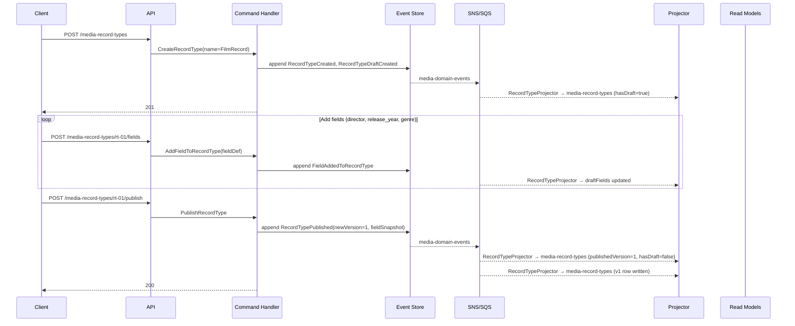

# RecordType — Business Scenarios

_Context: `Metadata` · Aggregate: `RecordType`_

---

## Index

| # | Scenario | Key Aggregates |
|---|---|---|
| M-1 | Create and Publish a RecordType Schema | RecordType |
| M-2 | Evolve a RecordType Field (Type Change) | RecordType |
| M-3 | Deprecate a RecordType | RecordType |
| M-4 | Bulk Metadata Update on a MediaItem (SetMetadataBatch) | MediaItem (cross-context) |

**Cross-context scenarios** involving RecordType and MediaProfile:
- Create and publish a MediaProfile (including attaching a RecordType) → see [Catalog Business Scenarios](../../../Catalog/business-scenarios.md)
- Re-pin a MediaProfile to a new RecordType version → see [Catalog Business Scenarios](../../../Catalog/business-scenarios.md)

---

## Diagram Key

```
Client  → API consumer (browser / integration)
API     → Ingest API or Query API Lambda
CH      → Command Handler Lambda
ES      → Event Store (DynamoDB media-events)
Bus     → SNS topic + SQS fan-out
Proj    → Projector Lambda(s)
RM      → Read Model DynamoDB tables
```

---

## M-1: Create and Publish a RecordType Schema

**Context:** An owner sets up a new `FilmRecord` schema and publishes it for use in MediaProfiles.

**Steps:**

1. `POST /media-record-types` → `CreateRecordType({name: "FilmRecord"})` → `RecordTypeCreated` + `RecordTypeDraftCreated({basedOnVersion: null})`
2. `POST /media-record-types/rt-01/fields` → `AddFieldToRecordType({fieldName: "director", fieldType: "Text", isRequired: true, order: 1})` → `FieldAddedToRecordType`
3. `POST /media-record-types/rt-01/fields` → `AddFieldToRecordType({fieldName: "release_year", fieldType: "Number", isRequired: true, minValue: 1888, maxValue: 2100, order: 2})` → `FieldAddedToRecordType`
4. `POST /media-record-types/rt-01/fields` → `AddFieldToRecordType({fieldName: "genre", fieldType: "MultiEnum", isRequired: false, allowedValues: ["Drama","Thriller","Comedy","Action","Horror"], order: 3})` → `FieldAddedToRecordType`
5. `POST /media-record-types/rt-01/publish` → `PublishRecordType` → `RecordTypePublished({newVersion: 1, fieldSnapshot: [...]})`. `media-record-types` gains a v1 row.

**Key invariants:**
- Draft RecordType versions cannot be pinned by MediaProfiles — only published versions appear in `media-record-types`.
- `FieldType` is immutable once published — type changes require `ReplaceFieldInRecordType` (see M-2).



---

## M-2: Evolve a RecordType Field (Type Change)

**Context:** `release_year` (Number) needs to become `release_date` (Date). The RecordType is at v3. MediaProfiles pinned to v3 are unaffected until explicitly re-pinned.

**Steps:**

1. `POST /media-record-types/{recordTypeId}/draft` → `CreateRecordTypeDraft` → `RecordTypeDraftCreated({basedOnVersion: 3, initialFields: [...copy of v3 fields...]})`. Published v3 unchanged.

2. `PUT /media-record-types/{recordTypeId}/fields/release_year/replace` → `ReplaceFieldInRecordType({newField: {fieldName: "release_date", fieldType: "Date", isRequired: true, order: 2}, migrationNote: "Migrating from year-only to full date. Existing release_year values orphaned."})` → `FieldReplacedInRecordType`. Applied to draft only.

3. `POST /media-record-types/{recordTypeId}/publish` → `PublishRecordType` → `RecordTypePublished({newVersion: 4, fieldSnapshot: [...]})`. Draft cleared. `media-record-types` gains a v4 row.

4. Existing MediaItems with `release_year` values in `Metadata.Draft` have orphaned data — the key remains in the dictionary but is no longer schema-valid against v4. Bulk migration via `SetMetadataField` is required.

5. MediaProfiles still pinned to `{recordTypeId, version: 3}` continue to validate against the v3 schema until the media-profile owner calls `UpdatePinnedRecordTypeVersion` to pin to v4 (see [Catalog Business Scenarios](../../../Catalog/business-scenarios.md)).

**Key invariants:**
- `FieldType` is immutable on `FieldDefinition`. Type change requires `ReplaceFieldInRecordType`.
- `ReplaceFieldInRecordType` requires a non-empty `MigrationNote`.
- Published version v3 snapshot is never modified — it remains available for media-profiles still pinned to it.
- Schema governance is forward-only: existing published MediaItems on v3 are not retroactively affected.

```mermaid
sequenceDiagram
    participant Client
    participant API
    participant CH as Command Handler
    participant ES as Event Store
    participant Bus as SNS/SQS
    participant Proj as Projector
    participant RM as Read Models

    Client->>API: POST /media-record-types/{id}/draft
    API->>CH: CreateRecordTypeDraft
    Note over CH: Opens draft from v3 (copy of published fields)
    CH->>ES: append RecordTypeDraftCreated(basedOnVersion=3)
    ES-->>Bus: media-domain-events
    Bus-->>Proj: RecordTypeProjector → media-record-types (hasDraft=true, draftFields=v3 copy)
    CH-->>Client: 200

    Client->>API: PUT /media-record-types/{id}/fields/release_year/replace
    API->>CH: ReplaceFieldInRecordType(release_date, migrationNote)
    Note over CH: Validates Draft != null ✓; MigrationNote non-empty ✓
    CH->>ES: append FieldReplacedInRecordType
    ES-->>Bus: media-domain-events
    Bus-->>Proj: RecordTypeProjector → draftFields (release_year → release_date); media-record-types NOT touched
    CH-->>Client: 200

    Client->>API: POST /media-record-types/{id}/publish
    API->>CH: PublishRecordType
    Note over CH: Draft non-empty ✓
    CH->>ES: append RecordTypePublished(newVersion=4, fieldSnapshot)
    ES-->>Bus: media-domain-events
    Bus-->>Proj: RecordTypeProjector → media-record-types (publishedVersion=4, hasDraft=false)
    Bus-->>Proj: RecordTypeProjector → media-record-types (v4 row written)
    CH-->>Client: 200

    Note over Client,RM: Profiles pinned to v3 still valid<br/>Orphaned release_year values require manual migration
```

---

## M-3: Deprecate a RecordType

**Context:** Admin deprecates a schema no longer fit for new MediaProfiles. Existing MediaProfiles pinned to any version continue to validate normally. No new MediaProfile may attach or re-pin to this type.

**Preconditions:** RecordType published at least once (`Version > 0`).
**Actor:** Owner (`caller.owner_id == recordType.OwnerId`)
**Trigger:** `POST /v1/metadata/record-types/{recordTypeId}/deprecate`

### Steps

1. Admin: `POST /v1/metadata/record-types/rt-01/deprecate`
   - `DeprecateRecordTypeCommand(TenantId, rt-01, OccurredAt)`
   - Handler loads RecordType → `Version = 3` ✅
   - `RecordType.Deprecate(OccurredAt)` → `RecordTypeDeprecated { RecordTypeId: rt-01, DeprecatedAt }`
   - `→ 202 Accepted`

2. `RecordTypeDeprecatedIntegrationEvent` → `media-integration-events` SNS

3. Catalog `RecordTypeStatusReferenceProjector`:
   - UPDATE `media-record-types` → `IsDeprecated = true` on all version rows for `rt-01`

4. Admin attempts `POST /v1/catalog/profiles/{profileId}/record-types/rt-01` (new attachment):
   - `AttachRecordTypeHandler` reads `media-record-types` → `IsDeprecated = true`
   - `→ 409 RecordTypeDeprecated` — blocked

5. Existing MediaProfile pinned to `{ rt-01, version: 2 }` remains functional:
   - Checkout, submit, review — all continue normally
   - Re-publish of a MediaProfile pinning a deprecated type is blocked by `PublishMediaProfileHandler`

### Key Invariants

- `Deprecated` is terminal — no re-activation
- Existing pins are not retroactively invalidated; Published items are unaffected
- Re-publish of a MediaProfile still pinning a deprecated RecordType is blocked
- `IsDeprecated` lives on the Catalog-owned `media-record-types` reference projection, not on the Metadata aggregate

### Error Path

```
POST /v1/metadata/record-types/rt-draft-only/deprecate   (Version = 0, never published)
→ 409 RecordTypeNotPublished
```

---

## M-4: Bulk Metadata Update on a MediaItem (SetMetadataBatch)

**Context:** Editor sets multiple metadata fields on a MediaItem in one atomic operation. All fields validated against the RecordType schema — any failure rejects the entire batch with no partial writes.

**Preconditions:** MediaItem exists in `Draft` or checked-out state; RecordType schema published and pinned to MediaProfile.
**Actor:** Owner (or caller with write access to the MediaItem)
**Trigger:** `PUT /v1/catalog/items/{itemId}/metadata`

> **Scope note:** Per-MediaItem operation — all fields belong to the same item. Cross-item bulk import (spreadsheet upload affecting many items) is out of scope for this version.

### Steps

1. Editor: `PUT /v1/catalog/items/mi-01/metadata`
   ```json
   {
     "fields": {
       "title": "Coastal Sunset",
       "release_year": 2026,
       "tags": ["landscape", "nature"],
       "description": "Golden hour shot from Cape Otway lighthouse"
     }
   }
   ```
   - `SetMetadataBatchCommand(TenantId, mi-01, fields[], OccurredAt)`

2. `SetMetadataBatchHandler`:
   - Loads MediaItem → resolves `MediaProfileId` → reads `media-profiles` for `CompiledTemplate`
   - For each field: type resolved server-side from `SnapshotFields` (`String` vs `Text` distinction requires schema — wire type alone is insufficient)
   - Validates all fields atomically — type, required, constraints
   - Any failure → `422 MetadataValidationFailed` with per-field errors; **no changes persisted**
   - All pass → `MediaItem.SetMetadataBatch(fields[])` → `MediaItemMetadataBatchSet`
   - `→ 204 No Content`

3. `MediaItemProjector` → UPDATE `media-items` and `media-item-detail` metadata payload

### Key Invariants

- Atomic — all-or-nothing; partial writes never occur
- Full replacement — payload replaces entire `Metadata` map; omitting a field clears it
- Prefer `SetMetadataBatch` over multiple `PATCH /metadata/{fieldName}` calls when updating several fields to avoid partial-write failure windows
- Checkout guard: item checked out by a different user → `409`

### Error Path

```json
// 422 — field type mismatch
{
  "type": "https://errors.magiqmedia.com/validation/metadata-validation-failed",
  "title": "Metadata validation failed",
  "status": 422,
  "extensions": {
    "errorCode": "MetadataValidationFailed",
    "fieldErrors": [
      { "fieldName": "release_year", "error": "Expected Number, got String" }
    ]
  }
}
```

---

## Related

- [Metadata Context Overview](../../context-overview.md)
- [RecordType Write Model](recordtype.write-model.md)
- [Catalog Business Scenarios](../../../Catalog/business-scenarios.md) — MediaProfile scenarios (create, publish, re-pin)
- [MediaItem Write Model](../../../Catalog/aggregates/MediaItem/mediaitem.write-model.md) — schema validation at RequestPublication
