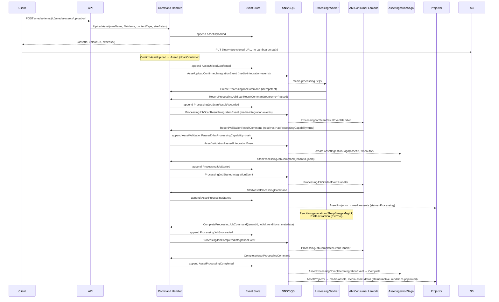
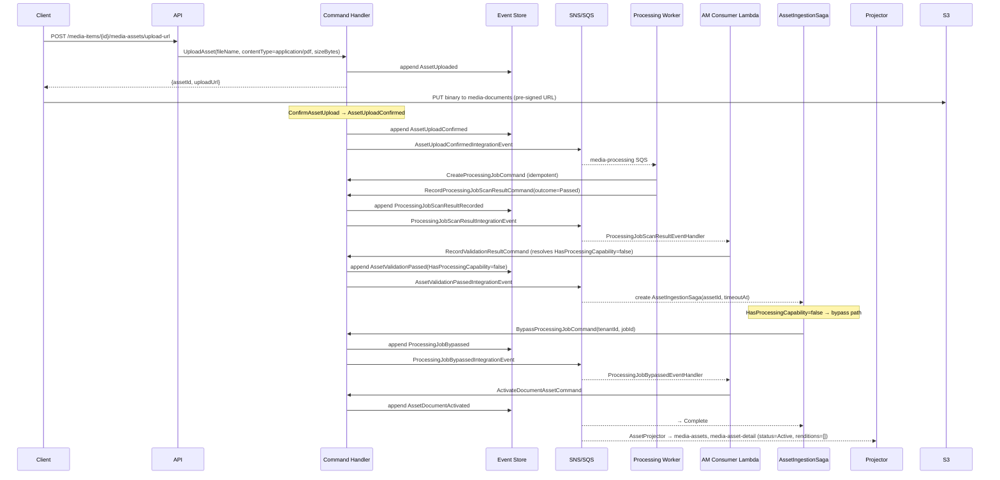
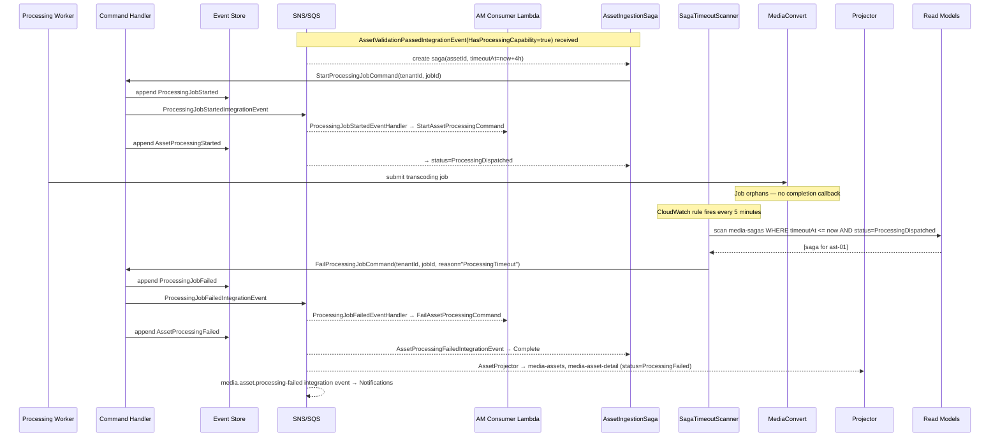

# ProcessingJob — Business Scenarios

_Context: `Processing` · Aggregate: `ProcessingJob`_

---

## Index

| # | Scenario | Key Aggregates |
|---|---|---|
| P-1 | Full Processing Pipeline (Image Asset) | ProcessingJob, Asset |
| P-2 | Document Asset — Fast Exit (No Processing Capability) | ProcessingJob, Asset |
| P-3 | Processing Pipeline Failure Recovery (Saga Timeout) | ProcessingJob, Asset, AssetIngestionSaga |

---

## Diagram Key

```
Client  → API consumer (browser / integration)
API     → Ingest API Lambda
CH      → Command Handler Lambda
ES      → Event Store (DynamoDB media-events)
Bus     → SNS topic + SQS fan-out
PW      → Processing Worker Lambda
AM      → AssetManagement integration event consumer Lambda
Saga    → AssetIngestionSaga (SagaOrchestrator Lambda)
Scanner → SagaTimeoutScanner Lambda
Proj    → Projector Lambda(s)
RM      → Read Model DynamoDB tables
```

---

## P-1: Full Processing Pipeline (Image Asset)

**Context:** An owner uploads a JPEG image to a MediaItem whose MediaProfile has the `Processing` capability. The full pipeline runs: virus scan, rendition generation (Sharp/ImageMagick), and EXIF extraction. The Processing Worker is triggered by `AssetUploadConfirmedIntegrationEvent` on the `media-processing` SQS queue.

**Steps:**

1. Client calls `POST /media-items/{mediaItemId}/media-assets/upload-url` → `UploadAsset({roleName: "primary-image", fileName: "poster.jpg", contentType: "image/jpeg", sizeBytes: 2048000})` → `AssetUploaded({assetId, mediaItemId, roleName, storageKey})`; response: `{assetId, uploadUrl, expiresAt}`.
2. Client PUTs binary directly to S3 using pre-signed URL — Lambda is not on the binary upload path.
3. `ConfirmAssetUpload` → `AssetUploadConfirmed` appended. `AssetUploadConfirmedIntegrationEvent` published to `media-integration-events` SNS.
4. Processing Worker receives `AssetUploadConfirmedIntegrationEvent` from `media-processing` SQS queue. `AssetUploadConfirmedEventHandler` creates `ProcessingJob` via `CreateProcessingJobCommand` (idempotent).
5. `AssetValidationWorker` resolves `ProcessingJobId` via `AssetProcessingJobIndex` (AssetId → JobId). Runs virus scan. Dispatches `RecordProcessingJobScanResultCommand(tenantId, jobId, outcome="Passed", ...)` → `ProcessingJobScanResultRecorded` → `ProcessingJobScanResultIntegrationEvent` published.
6. AM `ProcessingJobScanResultEventHandler` receives event → dispatches `RecordValidationResultCommand`. `RecordValidationResultHandler` resolves `HasProcessingCapability = true` via `IMediaItemCapabilityService` → calls `asset.RecordValidationResult(...)` → `AssetValidationPassed(HasProcessingCapability=true)` → `AssetValidationPassedIntegrationEvent` published.
7. `AssetIngestionSaga` receives `AssetValidationPassedIntegrationEvent`. Reads `HasProcessingCapability = true` → dispatches `StartProcessingJobCommand(tenantId, jobId)` → `ProcessingJobStarted` → `ProcessingJobStartedIntegrationEvent` published.
8. AM `ProcessingJobStartedEventHandler` dispatches `StartAssetProcessingCommand` → `AssetProcessingStarted` (Asset: Validating → Processing).
9. `AssetProcessingWorker` runs full pipeline via Lambda layer (Sharp/ImageMagick): generates thumbnail, compressed rendition; ExifTool extracts EXIF.
10. `AssetProcessingWorker` dispatches `CompleteProcessingJobCommand(tenantId, jobId, renditions, metadata)` → `ProcessingJobSucceeded` → `ProcessingJobCompletedIntegrationEvent` published.
11. AM `ProcessingJobCompletedEventHandler` dispatches `CompleteAssetProcessingCommand` → `AssetProcessingCompleted` (Asset: Processing → Active).
12. `AssetIngestionSaga` receives `AssetProcessingCompletedIntegrationEvent` → transitions to `Complete`.
13. `AssetProjector` updates `media-assets` and `media-asset-detail` (status = `Active`, renditions populated).

**Key invariants:**
- Lambda is never on the binary upload path — S3 pre-signed URL is client-direct.
- `HasProcessingCapability` is resolved by `RecordValidationResultHandler` (AssetManagement) and carried in `AssetValidationPassedIntegrationEvent` — the saga and Processing Worker need no cross-BC capability lookup.
- Processing publishes integration events only; AssetManagement dispatches all Asset aggregate commands on its own.



---

## P-2: Document Asset — Fast Exit (No Processing Capability)

**Context:** An owner uploads a PDF to a MediaItem whose MediaProfile lacks the `Processing` capability (a "document media-item" — quota-exempt). Virus scan runs; no renditions are generated. `AssetIngestionSaga` detects `HasProcessingCapability = false` and dispatches `BypassProcessingJobCommand`. Asset transitions directly to `Active` via `ActivateDocumentAsset`.

**Steps:**

1. Client calls `POST /media-items/{mediaItemId}/media-assets/upload-url` → `UploadAsset({fileName: "application-form.pdf", contentType: "application/pdf", sizeBytes: 512000})` → `AssetUploaded`. Response: `{assetId, uploadUrl}`.
2. Client PUTs binary to S3 via pre-signed URL (stored in `media-documents` bucket — not `media-source`).
3. `ConfirmAssetUpload` → `AssetUploadConfirmed` → `AssetUploadConfirmedIntegrationEvent` published.
4. Processing Worker receives event. `AssetUploadConfirmedEventHandler` creates `ProcessingJob`. `AssetValidationWorker` runs virus scan → `RecordProcessingJobScanResultCommand(outcome="Passed")` → `ProcessingJobScanResultIntegrationEvent`.
5. AM `ProcessingJobScanResultEventHandler` → `RecordValidationResultCommand`. `RecordValidationResultHandler` resolves `HasProcessingCapability = false` → `AssetValidationPassed(HasProcessingCapability=false)` → `AssetValidationPassedIntegrationEvent`.
6. `AssetIngestionSaga` receives `AssetValidationPassedIntegrationEvent`. Reads `HasProcessingCapability = false` → dispatches `BypassProcessingJobCommand(tenantId, jobId)` → `ProcessingJobBypassed` → `ProcessingJobBypassedIntegrationEvent`.
7. AM `ProcessingJobBypassedEventHandler` dispatches `ActivateDocumentAssetCommand` → `AssetDocumentActivated` (Asset: Validating → Active; renditions = `[]`, metadata = null).
8. `AssetIngestionSaga` transitions to `Complete`.
9. `AssetProjector` updates `media-assets` and `media-asset-detail` (status = `Active`, renditions = `[]`).

**Key invariants:**
- Document media-assets are stored in `media-documents` (not `media-source`).
- `Renditions` list is empty; `AssetMetadata` fields are null on the read model.
- These media-assets are quota-exempt — resolved via the `media-items` read model during upload initiation.
- `BypassProcessingJobCommand` is dispatched by the saga, not the Processing Worker — the Worker never reads capabilities.
- `ProcessingJob` status goes: Queued → Queued (scan recorded) → Bypassed. It never reaches `Running`.



---

## P-3: Processing Pipeline Failure Recovery (Saga Timeout)

**Context:** A video asset is stuck in `Processing` state — the MediaConvert job silently orphans due to an EventBridge misconfiguration. The `AssetIngestionSaga` timeout fires and forces a `ProcessingFailed` transition via `SagaTimeoutScanner`.

**Steps:**

1. Asset uploaded, confirmed, and scanned. `AssetValidationPassedIntegrationEvent(HasProcessingCapability=true)` published. `AssetIngestionSaga` created with `TimeoutAt = now + 4 hours` (Video content type).
2. Saga dispatches `StartProcessingJobCommand` → `ProcessingJobStarted` → `ProcessingJobStartedIntegrationEvent`. AM applies `StartAssetProcessingCommand` → `AssetProcessingStarted` (Asset status → `Processing`). Saga status → `ProcessingDispatched`.
3. `AssetProcessingWorker` submits job to AWS MediaConvert. Job orphans — no EventBridge completion callback arrives.
4. After 4 hours: `SagaTimeoutScanner` Lambda fires on 5-minute CloudWatch schedule. Scans `media-sagas` for instances where `TimeoutAt <= now AND status = ProcessingDispatched`.
5. `SagaTimeoutScanner` dispatches `FailProcessingJobCommand({tenantId, jobId, reason: "ProcessingTimeout"})`.
6. `FailProcessingJobCommandHandler` appends `ProcessingJobFailed` (ProcessingJob: Running → Failed). `ProcessingJobFailedIntegrationEvent` published.
7. AM `ProcessingJobFailedEventHandler` dispatches `FailAssetProcessingCommand(ProcessingError)` → `AssetProcessingFailed` appended (Asset status → `ProcessingFailed`).
8. `AssetProjector` updates `media-assets` and `media-asset-detail` (status = `ProcessingFailed`). `media.asset.processing-failed` integration event published → Notifications consumer alerts owner.
9. `AssetIngestionSaga` receives `AssetProcessingFailedIntegrationEvent` → transitions to `Complete`.

**Key invariants:**
- The saga covers only the `StartProcessingJobCommand`–`CompleteProcessingJobCommand` window. The `Queued → Running` transition is guarded by SQS DLQ (worker crash → message redelivery).
- `FailProcessingJobCommand` is idempotent — if the job has already succeeded (race between completion and timeout), the command is a no-op; AM's `FailAssetProcessingCommand` is also a no-op if Asset is already `Active`.
- S3 original is unaffected — the original file is retained; a future `RetryAssetProcessing` command (not in v1) can reprocess without re-upload.



---

## Related

- [Processing Context Overview](../../context-overview.md)
- [ProcessingJob Write Model](processingjob.write-model.md)
- [Asset Write Model](../../../AssetManagement/aggregates/Asset/asset.write-model.md)
- [AssetManagement Business Scenarios](../../../AssetManagement/business-scenarios.md)
