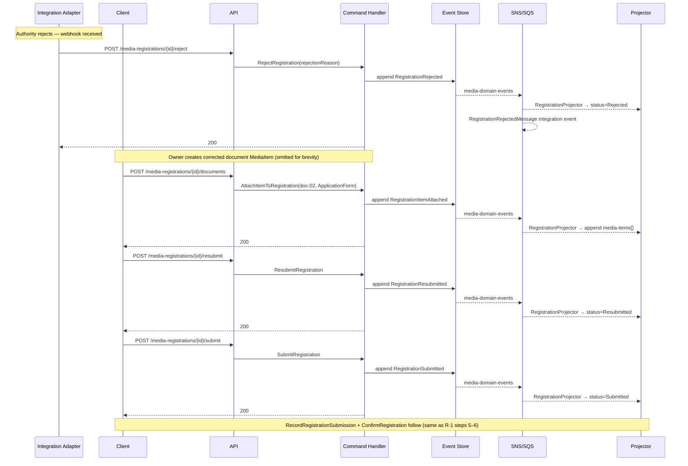

# Registration — Business Scenarios

_Context: `Registration` · Aggregate: `Registration`_

---

## Index

| # | Scenario | Key Aggregates |
|---|---|---|
| R-1 | Electronic Registration (Full Lifecycle) | Registration, MediaItem |
| R-2 | Registration Rejection and Resubmission | Registration |
| R-3 | Post-Confirmation Document Addition (Amendment) | Registration |
| R-4 | Registration Rejected — MediaItem Not Yet Published | Registration, MediaItem |
| R-5 | Registration Cancellation (Before Submission) | Registration |
| R-6 | Multi-Item Registration (Multiple Documents Attached) | Registration, MediaItem |

---

## Diagram Key

```
Client  → API consumer (browser / integration)
API     → Ingest API or Query API Lambda
CH      → Command Handler Lambda
ES      → Event Store (DynamoDB media-events)
Bus     → SNS/SQS
Proj    → Projector Lambda(s)
RM      → Read Model DynamoDB tables
Adapter → Registration integration adapter (System actor)
```

---

## R-1: Electronic Registration (Full Lifecycle)

**Context:** Owner initiates an electronic copyright media-registration for a published `FilmRecord` MediaItem. A document MediaItem (application form, no `Processing` capability) is attached before submission. The integration adapter records dispatch and the authority confirms.

**Steps:**

1. `POST /media-items/{mediaItemId}/media-registrations` → `InitiateRegistration({registrationType: "Electronic", registrationAuthority: "US Copyright Office"})` → authority normalised to `"US Copyright Office"` on write → `RegistrationInitiated`; `RegistrationInitiatedMessage` integration event published → `RegistrationInitiatedConsumer` (Catalog) receives via SQS → dispatches `AddRegistrationRefCommand` → `RegistrationRefAdded` emitted on MediaItem stream.

2. Owner creates a document MediaItem (media-profile without `Processing` capability): `POST /media-items` → `CreateMediaItem({title: "Copyright Form", mediaProfileId: "reg-doc-profile"})` → `MediaItemCreated`. Uploads PDF → virus scan only (fast-exit pipeline) → `Published`.

3. `POST /media-registrations/{registrationId}/documents` → `AttachItemToRegistration({mediaItemId: "doc-01", itemType: "ApplicationForm"})` → validates: `MediaItem = Published` ✓; `MediaProfile lacks Processing` ✓ → `RegistrationItemAttached`.

4. `POST /media-registrations/{registrationId}/submit` → `SubmitRegistration` → validates: `Status = Initiated` ✓; `Items.Count ≥ 1` ✓ → `RegistrationSubmitted` (`Initiated → Submitted`).

5. Owner dispatches submission externally (e.g., uploads form to copyright.gov portal). `POST /media-registrations/{registrationId}/submission` → `RecordRegistrationSubmission` → `RegistrationSubmissionRecorded` (`Submitted → PendingConfirmation`).

6. External authority confirms. Integration adapter calls `POST /media-registrations/{registrationId}/confirm` → `ConfirmRegistration({reference: "1-12345ABC"})` → `RegistrationConfirmed` (`PendingConfirmation → Confirmed`). `RegistrationConfirmedMessage` integration event published.

**Key invariants:**
- Registration documents must be `Published` MediaItems whose MediaProfile lacks the `Processing` capability (quota-exempt document media-items).
- `RegistrationAuthority` is title-cased on write; acronyms like "US" are preserved (not lowercased before title-casing).
- `PendingConfirmation` state exists between owner dispatch and authority decision — `RecordRegistrationSubmission` bridges these.
- `POST /confirm` is System-only — only the integration adapter may advance to `Confirmed`.

```mermaid
sequenceDiagram
    participant Client
    participant API
    participant CH as Command Handler
    participant ES as Event Store
    participant Bus as SNS/SQS
    participant Proj as Projector
    participant RM as Read Models
    participant Adapter as Integration Adapter

    Client->>API: POST /media-items/{id}/media-registrations
    API->>CH: InitiateRegistration(Electronic, "US Copyright Office")
    Note over CH: Normalise authority → "US Copyright Office" (title-case; acronyms preserved)
    CH->>ES: append RegistrationInitiated
    ES-->>Bus: media-domain-events
    Bus-->>Proj: RegistrationProjector → media-registrations, media-registration-detail (INSERT)
    Bus-->>Bus: RegistrationInitiatedMessage (published inline by RegistrationIntegrationEventPublisher → media-integration-events)
    Bus-->>Catalog: RegistrationInitiatedConsumer → AddRegistrationRefCommand
    Catalog->>ES: append RegistrationRefAdded (MediaItem stream)
    ES-->>Bus: media-domain-events
    Bus-->>Proj: MediaItemProjector → media-item-detail (registrationIds[] UPDATE)
    CH-->>Client: 201 {registrationId}

    Note over Client,RM: Owner creates + publishes a document MediaItem<br/>(application form; no Processing capability; fast-exit pipeline)

    Client->>API: POST /media-registrations/{id}/documents
    API->>CH: AttachItemToRegistration(mediaItemId=doc-01, itemType=ApplicationForm)
    Note over CH: Validate: Published ✓; no Processing capability ✓
    CH->>ES: append RegistrationItemAttached
    ES-->>Bus: media-domain-events
    Bus-->>Proj: RegistrationProjector → media-registration-detail (append media-items[])
    CH-->>Client: 200

    Client->>API: POST /media-registrations/{id}/submit
    API->>CH: SubmitRegistration
    Note over CH: Status=Initiated ✓; Items.Count≥1 ✓
    CH->>ES: append RegistrationSubmitted
    ES-->>Bus: media-domain-events
    Bus-->>Proj: RegistrationProjector → status=Submitted
    CH-->>Client: 200

    Note over Client: Owner dispatches externally (copyright.gov)

    Client->>API: POST /media-registrations/{id}/submission
    API->>CH: RecordRegistrationSubmission
    CH->>ES: append RegistrationSubmissionRecorded
    ES-->>Bus: media-domain-events
    Bus-->>Proj: RegistrationProjector → status=PendingConfirmation
    CH-->>Client: 200

    Note over Adapter: External authority confirms

    Adapter->>API: POST /media-registrations/{id}/confirm
    API->>CH: ConfirmRegistration(reference="1-12345ABC")
    CH->>ES: append RegistrationConfirmed
    ES-->>Bus: media-domain-events
    Bus-->>Proj: RegistrationProjector → status=Confirmed, reference set
    Bus-->>Bus: RegistrationConfirmedMessage integration event
    CH-->>Adapter: 200
```

---

## R-2: Registration Rejection and Resubmission

**Context:** The external authority rejects the media-registration due to an incomplete application. The owner corrects the documents and resubmits.

**Steps:**

1. Registration is at `PendingConfirmation` (after Scenario R-1 steps 1–5).
2. Integration adapter receives rejection webhook. `POST /media-registrations/{registrationId}/reject` → `RejectRegistration({rejectionReason: "Incomplete application form — missing signature page."})` → `RegistrationRejected` (`PendingConfirmation → Rejected`). `RegistrationRejectedMessage` published.
3. Owner uploads corrected application form document MediaItem → `Published`.
4. `POST /media-registrations/{registrationId}/documents` → `AttachItemToRegistration({mediaItemId: "doc-02", itemType: "ApplicationForm"})` → `RegistrationItemAttached`.
5. `POST /media-registrations/{registrationId}/resubmit` → `ResubmitRegistration` → `RegistrationResubmitted` (`Rejected → Resubmitted`).
6. `POST /media-registrations/{registrationId}/submit` → `SubmitRegistration` → validates: `Status = Resubmitted` ✓; `Items.Count ≥ 1` ✓ → `RegistrationSubmitted` (`Resubmitted → Submitted`).
7. `POST /media-registrations/{registrationId}/submission` → `RecordRegistrationSubmission` → `RegistrationSubmissionRecorded` (`Submitted → PendingConfirmation`).
8. Authority confirms. `POST /media-registrations/{registrationId}/confirm` → `RegistrationConfirmed`.

**Key invariants:**
- Additional documents may be attached at any status except `Confirmed` and `Cancelled` — attachments accumulate; they are not replaced.
- `Resubmit` can only be called from `Rejected` status.
- `Submit` accepts both `Initiated` and `Resubmitted` as valid source states.



---

## R-3: Post-Confirmation Document Addition (Amendment)

**Context:** A media-registration is already `Confirmed`. The authority requests an additional confirmation receipt document. The owner requests an amendment; the integration adapter approves it, atomically attaching the document.

**Steps:**

1. Registration is at `Confirmed` with `reference = "1-12345ABC"`.
2. `POST /media-registrations/{registrationId}/amendments` → `RequestAmendment({amendmentId: "amd-01", mediaItemId: "doc-03", itemType: "ConfirmationReceipt"})` → validates: `Status = Confirmed` ✓; no pending amendment for `doc-03` ✓; document is `Published` with no `Processing` capability ✓ → `RegistrationAmendmentRequested`.
3. Integration adapter approves. `POST /media-registrations/{registrationId}/amendments/amd-01/approve` → `ApproveAmendment({decisionNotes: "Confirmation receipt accepted."})` → two events appended atomically:
   - `RegistrationAmendmentApproved({amendmentId: "amd-01", ...})`
   - `RegistrationItemAttached({mediaItemId: "doc-03", itemType: "ConfirmationReceipt", addedViaAmendmentId: "amd-01", addedAt: ...})`
4. `RegistrationProjector` processes both events: amendment `status → Approved`; `doc-03` appended to `media-items[]` with `addedViaAmendmentId = "amd-01"`.

**Key invariants:**
- `AttachItemToRegistration` is blocked when `Status = Confirmed` — must use amendment workflow.
- `ApproveAmendment` raises `RegistrationAmendmentApproved` + `RegistrationItemAttached` atomically — both events are written in the same event-store transaction.
- The projector handles both events together: amendment resolved + document appended.
- Only one `Pending` amendment per `MediaItemId` per media-registration — duplicate check is aggregate-side.

```mermaid
sequenceDiagram
    participant Client
    participant API
    participant CH as Command Handler
    participant ES as Event Store
    participant Bus as SNS/SQS
    participant Proj as Projector
    participant RM as Read Models
    participant Adapter as Integration Adapter

    Note over Client,RM: Registration is Confirmed (reference set)

    Client->>API: POST /media-registrations/{id}/amendments
    API->>CH: RequestAmendment(amendmentId=amd-01, doc-03, ConfirmationReceipt)
    Note over CH: Status=Confirmed ✓; no pending amendment for doc-03 ✓<br/>doc-03: Published ✓; no Processing capability ✓
    CH->>ES: append RegistrationAmendmentRequested
    ES-->>Bus: media-domain-events
    Bus-->>Proj: RegistrationProjector → append amendments[] (status=Pending)
    CH-->>Client: 201 {amendmentId}

    Adapter->>API: POST /media-registrations/{id}/amendments/amd-01/approve
    API->>CH: ApproveAmendment(amd-01, decisionNotes)
    CH->>ES: append RegistrationAmendmentApproved (atomic write)
    CH->>ES: append RegistrationItemAttached(addedViaAmendmentId=amd-01) (same write)
    ES-->>Bus: media-domain-events
    Bus-->>Proj: RegistrationProjector → amendment status=Approved + append media-items[doc-03]
    CH-->>Adapter: 200
```

---

## R-4: Registration Rejected — MediaItem Not Yet Published

**Context:** User attempts to initiate a registration or attach a MediaItem to an existing registration when the item has not yet reached `Published` status. Both handlers enforce the same `IsPublished` guard.

**Preconditions:** MediaItem exists in `Draft` or `UnderReview` status (not `Published`).
**Actor:** Owner
**Triggers:**
- `POST /v1/registrations` (initiate with unpublished item)
- `POST /v1/registrations/{registrationId}/documents` (attach unpublished item to existing registration)

### Steps — Initiate path

1. User: `POST /v1/registrations`
   ```json
   { "mediaItemId": "mi-draft-01", "registrationType": "Copyright" }
   ```
   - `InitiateRegistrationCommand(TenantId, mi-draft-01, ...)`
   - `InitiateRegistrationCommandHandler` reads `media-item-registration-refs` reference model
   - `mediaItemRef.IsPublished = false` → `→ 409 MediaItemNotPublished`
   - No Registration aggregate created; no event

### Steps — Attach path

1. User: `POST /v1/registrations/reg-01/documents`
   ```json
   { "mediaItemId": "mi-draft-01", "itemType": "ApplicationForm" }
   ```
   - `AttachMediaItemToRegistrationCommand(TenantId, reg-01, mi-draft-01, ...)`
   - `AttachMediaItemToRegistrationHandler` checks `mediaItemRef.IsPublished = false`
   - `→ 409 MediaItemNotPublished`
   - Registration reg-01 unchanged

### Key Invariants

- Guard enforced at handler-side via `media-item-registration-refs` read model (not aggregate)
- Both `InitiateRegistration` and `AttachItemToRegistration` share the same `IsPublished` check
- `Published` = `MediaItemStatus.Published` (post-approval). `UnderReview` and `Draft` are both rejected
- The check is handler-side — the Registration aggregate itself does not enforce this; it trusts the handler

### Error Response

```json
{
  "type": "https://errors.magiqmedia.com/domain/media-item-not-published",
  "title": "Media item is not published",
  "status": 409,
  "detail": "MediaItem mi-draft-01 must be in Published status before it can be registered.",
  "extensions": { "errorCode": "MediaItemNotPublished" }
}
```

---

## R-5: Registration Cancellation (Before Submission)

**Context:** Owner cancels a registration that was initiated but not yet submitted to the external authority. Cancellation is permitted at any status except `Confirmed` and `Cancelled`.

**Preconditions:** Registration in `Initiated` status (or any non-terminal status except `Confirmed`).
**Actor:** Owner (`RegistrationOfficerId`)
**Trigger:** `POST /v1/registrations/{registrationId}/cancel`

### Steps

1. Owner: `POST /v1/registrations/reg-01/cancel`
   - `CancelRegistrationCommand(TenantId, reg-01, OfficerId, CanceledAt)`
   - Handler loads Registration → `Status = Initiated` ✅
   - `Registration.Cancel(CanceledAt)` → guard: `Status ≠ Confirmed` ✅, `Status ≠ Cancelled` ✅
   - `RegistrationCancelled { RegistrationId: reg-01, PriorStatus: Initiated, CanceledAt }`
   - `→ 204 No Content`

2. `RegistrationCancelledIntegrationEvent` published → downstream notifications

3. `RegistrationProjector` → `status = Cancelled` in read model

### Key Invariants

- `Cancelled` is terminal — no further operations (attach, submit, amend) permitted
- `Confirmed` registrations cannot be cancelled — external authority has already confirmed; use an amendment process
- Cancellation is permitted at: `Initiated`, `Submitted`, `PendingConfirmation`, `Rejected`
- `PriorStatus` carried in event for audit trail

### Error Responses

```json
// 409 — already cancelled
{
  "type": "https://errors.magiqmedia.com/domain/registration-already-cancelled",
  "title": "Registration is already cancelled",
  "status": 409,
  "extensions": { "errorCode": "RegistrationAlreadyCancelled" }
}

// 409 — confirmed, cannot cancel
{
  "type": "https://errors.magiqmedia.com/domain/registration-confirmed",
  "title": "Confirmed registration cannot be cancelled",
  "status": 409,
  "extensions": { "errorCode": "RegistrationConfirmed" }
}
```

---

## R-6: Multi-Item Registration (Multiple Documents Attached)

**Context:** Owner initiates a registration for a primary document, then attaches supporting documents before submission. R-1 covers single-document; this scenario covers the multi-document path.

**Preconditions:** Primary MediaItem is `Published`. Supporting documents are `Published`. Neither has the `Processing` capability (registration requires document-type assets).
**Actor:** Owner
**Trigger:** `POST /v1/catalog/items/{itemId}/registrations` + multiple `POST /v1/registrations/{registrationId}/documents`

### Steps

1. Owner initiates with primary document:
   ```
   POST /v1/catalog/items/doc-primary/registrations
   { "registrationType": "Copyright", "jurisdiction": "AU" }
   → 201 { "registrationId": "reg-01" }
   ```
   - `RegistrationInitiated { Items: [{ doc-primary, Primary }] }`

2. Attach supporting document 1:
   ```
   POST /v1/registrations/reg-01/documents
   { "mediaItemId": "doc-exhibit-a", "itemType": "SupportingDocument" }
   → 200
   ```
   - `AttachMediaItemToRegistrationHandler` validates: `Published` ✅, no `Processing` capability ✅, not already attached ✅
   - `RegistrationItemAttached { MediaItemId: doc-exhibit-a, ItemType: SupportingDocument }`

3. Attach supporting document 2:
   ```
   POST /v1/registrations/reg-01/documents
   { "mediaItemId": "doc-exhibit-b", "itemType": "SupportingDocument" }
   → 200
   ```
   - `RegistrationItemAttached { MediaItemId: doc-exhibit-b }`

4. Owner submits:
   ```
   POST /v1/registrations/reg-01/submit
   → 200
   ```
   - `RegistrationSubmitted { Items: [doc-primary, doc-exhibit-a, doc-exhibit-b] }`

### Key Invariants

- No cap on document count per registration (domain does not enforce a limit)
- Each attach call is independent — one failure does not block others
- Duplicate attach (`doc-exhibit-a` again) → `409` — document already attached
- Confirmed registrations use the amendment endpoint, not `/documents`, to add items post-confirmation
- All attached items must be `Published`; items with `Processing` capability are rejected at attach time

### Error Response — Duplicate Attach

```json
{
  "type": "https://errors.magiqmedia.com/domain/document-already-attached",
  "title": "Document already attached",
  "status": 409,
  "extensions": { "errorCode": "DocumentAlreadyAttached", "mediaItemId": "doc-exhibit-a" }
}
```

---

## Related

- [Registration Context Overview](../../context-overview.md)
- [Registration Write Model](media-registration.write-model.md)
- [Registration Read Model](media-registration.read-model.md)
- [Registration API](media-registration.api.md)
- [Processing Context — P-2](../../../Processing/business-scenarios.md) — document asset fast-exit pipeline
