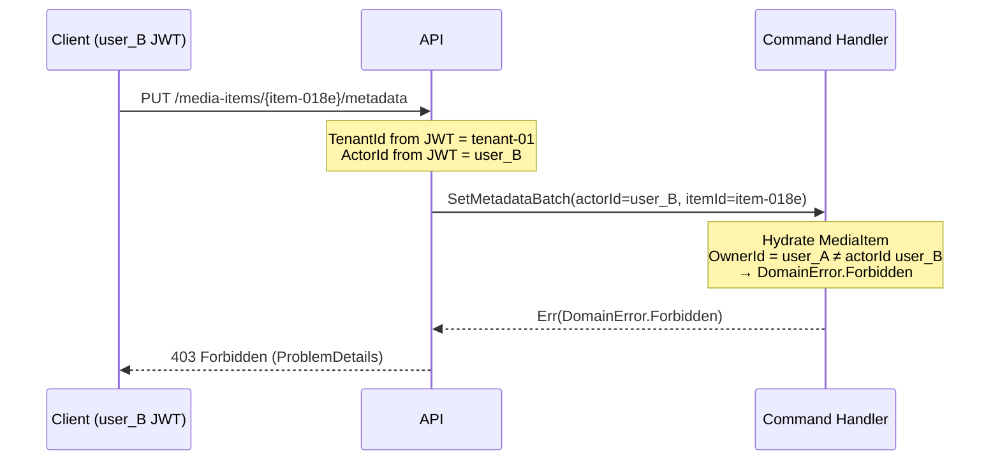
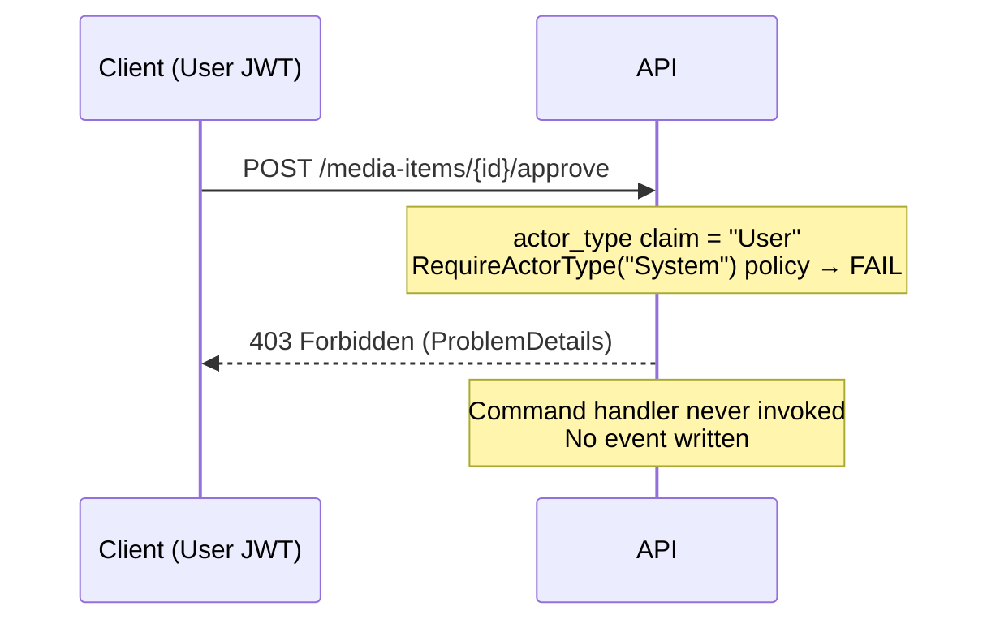
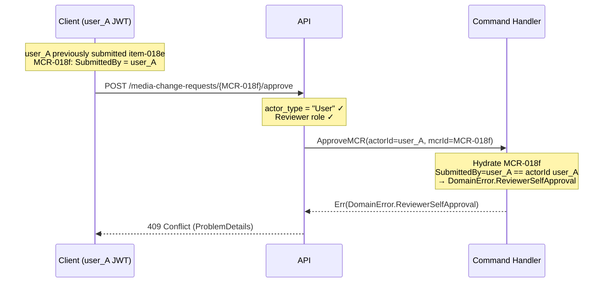

# Security & Authorization Scenarios
_magiq-media · Shared reference across all bounded contexts_

These scenarios cover authentication and authorization enforcement — the negative cases that verify security boundaries. They are cross-cutting and not specific to any single bounded context. All expected error responses conform to [api-conventions.md §Error Contract](./api-conventions.md#error-contract--rfc-9457-problemdetails).

---

## Index

| # | Scenario | Status Code | Context |
|---|---|---|---|
| PERM-1 | Cross-Owner Write Attempt | `403 Forbidden` | Any |
| PERM-2 | User Actor Calls System-Only Endpoint | `403 Forbidden` | Catalog |
| PERM-3 | Reviewer Self-Approval Block | `409 Conflict` | ChangeRequests |

---

## Diagram Key

```
Client  → API consumer (browser / integration / Postman)
API     → FastEndpoints endpoint in Media.Api Lambda
CH      → Command Handler Lambda
```

Arrows: `→` request · `-->>` response

---

## PERM-1: Cross-Owner Write Attempt (403)

**Context:** A User actor within the same tenant attempts to mutate a resource they do not own. This covers the intra-tenant ownership boundary — cross-tenant isolation is enforced structurally by the DynamoDB PK prefix `TENANT#{TenantId}#` (a user from Tenant B cannot reach Tenant A's media-items at all; they receive `404 Not Found`).

**Pre-conditions:**
- `user_A` owns MediaItem `item-018e`. `item-018e` exists in `media-items` with `OwnerId = user_A`.
- `user_B` is authenticated in the same tenant with a valid JWT (`actor_type = "User"`, `tenant_id = "tenant-01"`), but `user_B ≠ user_A`.

**Steps:**

1. `user_B` calls `PUT /media-items/{item-018e}/metadata` using their own JWT.
2. The command handler resolves `OwnerId` from the MediaItem aggregate state.
3. `OwnerId (user_A) ≠ actor.Id (user_B)` → authorization check fails.
4. Command handler returns `DomainError.Forbidden` → API maps to `403 Forbidden`.

**Expected response:**

```http
HTTP/1.1 403 Forbidden
Content-Type: application/problem+json

{
  "type": "https://errors.magiqmedia.com/domain/forbidden",
  "title": "Access denied",
  "status": 403,
  "detail": "Actor user_B does not have write access to MediaItem 018e4c7a-... owned by user_A.",
  "instance": "/v1/media-items/018e4c7a-.../metadata",
  "extensions": {
    "errorCode": "Forbidden",
    "resourceOwner": "user_A"
  }
}
```

**Key invariants:**
- No event is written. The command handler rejects before mutating aggregate state.
- `TenantId` is always sourced from the JWT `tenant_id` claim — it is never supplied as a query parameter or path segment. Cross-tenant isolation is structural, not a permission check.
- The same ownership guard applies to all write commands on `MediaItem`, `Collection`, `Folder`, `Asset`, and `Registration` aggregates — the pattern is uniform, not endpoint-specific.
- Ownership is resolved from the aggregate's current state (event-sourced hydration), not from the read model.



**Postman negative test:** Send a `PUT /media-items/{ownerAItemId}/metadata` request with `user_B`'s token. Assert `403` and `errorCode = "Forbidden"`.

---

## PERM-2: User Actor Calls System-Only Endpoint (403)

**Context:** A User actor presents a valid JWT but calls an endpoint that is restricted to `actor_type = "System"`. The canonical example is `POST /media-items/{id}/approve` — this endpoint exists solely for the `MediaItemReviewSaga` to dispatch system-side approval and must never be callable by a human user.

**Pre-conditions:**
- MediaItem `item-018e` exists in `UnderReview` status.
- A valid User JWT is presented (`actor_type = "User"`, roles include no System privileges).

**Steps:**

1. `user_A` calls `POST /media-items/{item-018e}/approve` with their User JWT.
2. The FastEndpoints policy evaluates the `actor_type` claim.
3. `actor_type = "User"` does not satisfy the `RequireActorType("System")` policy.
4. Request rejected before reaching the command handler.
5. Returns `403 Forbidden`.

**Expected response:**

```http
HTTP/1.1 403 Forbidden
Content-Type: application/problem+json

{
  "type": "https://errors.magiqmedia.com/domain/actor-type-forbidden",
  "title": "Actor type not permitted",
  "status": 403,
  "detail": "Endpoint POST /media-items/{id}/approve requires actor_type 'System'. Presented token has actor_type 'User'.",
  "instance": "/v1/media-items/018e4c7a-.../approve",
  "extensions": {
    "errorCode": "ActorTypeForbidden",
    "requiredActorType": "System",
    "presentedActorType": "User"
  }
}
```

**Key invariants:**
- Actor type enforcement is applied at the FastEndpoints authorization layer — it does not reach the command handler.
- No event is written; the MediaItem aggregate is not hydrated.
- System-only endpoints are: `POST /media-items/{id}/approve`, `POST /media-items/{id}/force-release-checkout`. Any future System-only endpoint must declare `RequireActorType("System")` in its FastEndpoints endpoint definition.
- A `Guest` actor (no JWT) returns `401 Unauthorized` before actor type checks run — the `403` is specific to an authenticated non-System actor.



**Postman negative test:** Call `POST /media-items/{id}/approve` with an owner JWT (User actor type). Assert `403` and `errorCode = "ActorTypeForbidden"`. The media-item must remain in its current status when checked via `GET /media-items/{id}`.

---

## PERM-3: Reviewer Self-Approval Block (409)

**Context:** In a review-gated publish workflow, the user who submitted the MediaItem for review (`SubmitForReview` caller = `user_A`) attempts to approve their own `MediaChangeRequest`. Self-review is a domain invariant violation — it returns `409 Conflict`, not `403`, because the actor is fully authenticated and authorized as a reviewer in general; the specific business rule blocks this instance.

**Pre-conditions:**
- `user_A` submitted MediaItem `item-018e` for review: `POST /media-items/{item-018e}/submit` → `MediaItemSubmittedForReview`. `MediaItemReviewSaga` created `MediaChangeRequest MCR-018f` with `SubmittedBy = user_A`.
- `user_A` holds a reviewer role within the tenant (e.g., `roles: ["Reviewer", "Owner"]`).
- MCR-018f is in `Open` status.

**Steps:**

1. `user_A` calls `POST /media-change-requests/{MCR-018f}/approve` with their own JWT.
2. The command handler hydrates MCR-018f.
3. Checks: `SubmittedBy (user_A) == actor.Id (user_A)` → self-review invariant violated.
4. Returns `DomainError.ReviewerSelfApproval` → API maps to `409 Conflict`.

**Expected response:**

```http
HTTP/1.1 409 Conflict
Content-Type: application/problem+json

{
  "type": "https://errors.magiqmedia.com/domain/reviewer-self-approval",
  "title": "Self-review not permitted",
  "status": 409,
  "detail": "Actor user_A submitted this MediaItem for review and cannot approve their own submission.",
  "instance": "/v1/media-change-requests/018e4d00-.../approve",
  "extensions": {
    "errorCode": "ReviewerSelfApproval",
    "submittedBy": "user_A"
  }
}
```

**Key invariants:**
- The `SubmittedBy` actor identity is captured in `MediaItemSubmittedForReview` and persisted in the MCR aggregate state — it is not re-derived from the read model.
- No event is written. The MCR remains in `Open` status.
- `user_A` may still perform other reviewer actions on MCRs submitted by other users — this invariant is scoped to the specific MCR, not a global role restriction.
- `user_A` retains their ownership actions on the MediaItem (e.g., withdraw if needed) — this block applies only to the review approval action.



**Postman negative test:** Run the C-2 (Review-Gated variant) happy path up to the MCR creation step. Then call `POST /media-change-requests/{mcrId}/approve` with the *same* token that called `POST /media-items/{id}/submit`. Assert `409` and `errorCode = "ReviewerSelfApproval"`.

---

## Related

- [API Conventions — Error Contract](./api-conventions.md#error-contract--rfc-9457-problemdetails)
- [API Conventions — Actor Types](./api-conventions.md#actor-types)
- [Catalog Business Scenarios](../contexts/Catalog/business-scenarios.md) — submit flow (C-2, MW-6)
- [ChangeRequests Business Scenarios](../contexts/ChangeRequests/business-scenarios.md) — review-gated publish (CR-1)
